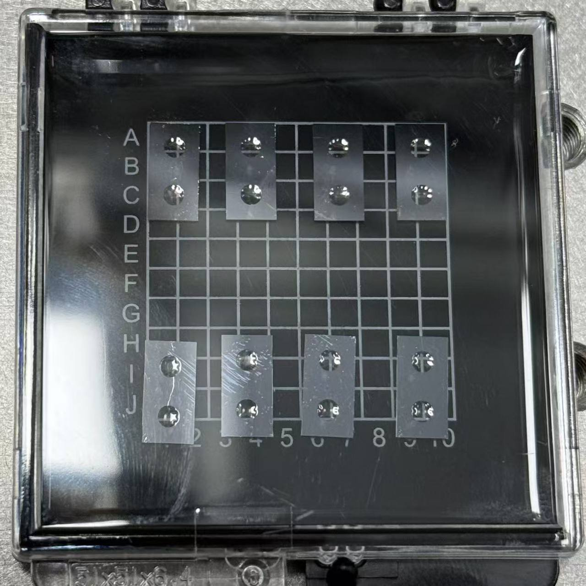

# 2026-05-20 深硅刻蚀加工 session

## 基本信息

- 地点：北京大学昌平校区。
- 参与人员：我、吴祖磊。
- 工艺主题：深硅刻蚀测试与正式样品加工。
- 记录类型：现场加工记录、参数记录、异常观察、后处理记录。

## 样品层级与命名

- 一整片 wafer 上共有 9 个 chip。
- 一个 chip 指沿深硅设计槽裂片后得到的约 2 cm x 2 cm 方块。
- 每个 chip 上有 8 个或 16 个 die。
- 8 die 版本：单个 die 通常约 5 mm x 1 cm。
- 16 die 版本：单个 die 通常约 5 mm x 5 mm。
- 本次图示 chip 为 16 die 版本，die 排布为 4 x 4。
- die 按行列命名为 `diex-x`：从样品正面观察，左上角为 `die1-1`，向右列号增加，向下行号增加。

## 深硅刻蚀 recipe

### Bosch 循环参数

- 工艺类型：Bosch 交替循环深硅刻蚀。
- 下方刻蚀温度 / chuck 温度：-5 degC。

沉积 / passivation 步骤：

- 气体：C4F8。
- C4F8 流量：150 sccm。
- ICP / source power：1000 W。
- bias / platen power：4 W。
- 时间：5 s。

刻蚀 / etch 步骤：

- 气体：SF6 + O2。
- SF6 流量：240 sccm。
- O2 流量：20 sccm。
- ICP / source power：1000 W。
- bias / platen power：25 W。
- 时间：5 s。

### 气压使用记录

- 纯 SiO2 测试片：原计划尝试 9 Pa；因 9 Pa 条件下不好启辉，根据北大工程师经验改为 7 Pa；7 Pa 下启辉成功。
- 带结构 / 纯硅测试片：9 Pa 下可以启辉。
- 正式样品加工：9 Pa。

现场判断：

- 纯 SiO2 测试片 9 Pa 不好启辉可能与 SiO2 本身不导电有关。
- 不能把该现象直接推广为“9 Pa recipe 普遍不好启辉”。

## SiO2 消耗速率标定片

### 样品用途

- 该片不是正式深硅刻蚀样品。
- 该片用于测试当前深硅刻蚀参数下，SiO2 的刻蚀速度 / 消耗速率。
- 测试片为自带约 2 um SiO2 片。

### 测量与刻蚀

- 刻蚀前测量方式：椭偏仪。
- 刻蚀前 SiO2 厚度：2024 nm。
- 实际刻蚀条件：7 Pa，50 cycle。
- 刻蚀后 SiO2 厚度：1870.31 nm。

### 结果计算

- SiO2 消耗厚度：153.69 nm。
- 平均消耗量：3.07 nm/cycle。
- 若 1 cycle = C4F8 5 s + SF6/O2 5 s，则 50 cycle 总时长为 500 s，约 8.33 min。
- 按完整 cycle 时间估算，SiO2 平均消耗速率约 18.44 nm/min。

观察：

- 刻蚀后，边缘压环覆盖 / 影响区域与中间裸露区域颜色存在些许差异。

待确认：

- 1870.31 nm 的测量点位置。
- 若需要判断均匀性，应补中心、边缘裸露区、压环附近区域的多点椭偏测厚。

## 硅刻蚀速率测试

### 测试样品

- 使用一片此前带有结构、同时包含纯硅区域的样品。
- 本次测试区域为此前被胶覆盖、现场擦去部分胶后暴露出的区域。
- 该区域此前被胶保护，因此刻蚀前台阶主要对应胶厚。

### 测量与刻蚀

- 刻蚀前：用台阶仪测得胶厚约 10 um。
- 刻蚀条件：9 Pa，50 cycle。
- 刻蚀后：台阶仪从胶表面量到底部，总深度约 70 um。

### 结果计算

- 本次硅刻蚀深度约为 70 um - 10 um = 60 um。
- 平均硅刻蚀量约为 60 um / 50 cycle = 1.2 um/cycle。
- 北大工程师经验值：该 recipe 下约 1 um/cycle。
- 本次实测与工程师经验值同量级，略高。

### 与 SiO2 数据的关系

严谨结论：

- SiO2 数据来自 7 Pa，Si 数据来自 9 Pa，不能作为严格的 Si:SiO2 选择比。
- 纯 SiO2 测试片存在启辉困难，可能进一步影响该组数据的代表性。

工程量级参考：

- Si 刻蚀速率约 1200 nm/cycle。
- SiO2 消耗速率约 3.07 nm/cycle。
- 粗略 Si:SiO2 量级对比约为 1200 / 3.07 = 391:1。
- 该值只能作为现场工艺窗口的粗略参考，不能作为正式选择比数据。

## 正式样品装载

### 刻蚀前状态

- 正式样品由于此前操作问题碎成三块。
- 本轮装载时，三块碎片按原片相对位置大致拼合，整体上恢复为原来的片形轮廓。
- 样品表面包含阵列结构与图形区域。

### 初始装载方式

- 将三块正式样品放置在一片纯硅载片上。
- 硅油仅涂在正式样品碎片与纯硅载片之间，用于辅助接触 / 固定。
- 纯硅载片整体放置在八英寸铝盘上。
- 纯硅载片与八英寸铝盘之间没有额外固定或导热处理。
- 铝盘整体由石英压环压住。
- 石英压环中间暴露出约四英寸大小的刻蚀区域。
- 最外圈约 1 mm 区域被压环遮住；该区域没有结构。
- 纯硅载片最外圈下方对应的铝盘位置有一圈均匀间隔分布的小孔；据北大工程师说明，这些小孔用于散热。

现场判断与观察：

- 三块碎片拼合后，现场判断不容易翘起或移动。
- 装载后观察，未看到明显翘起或移动。

照片证据：

- 已拍摄装载状态照片，用于记录正式样品刻蚀前的放置方式、碎片状态与压环暴露区域。
- 已保存到本 session 的 `images/001_formal_sample_loaded_quartz_ring.jpg`。

## 正式样品刻蚀过程

### 100 cycle 后

刻蚀条件：

- 气压：9 Pa。
- 累计刻蚀脉冲数：100 cycle。

观察：

- 部分结构区域出现变黑。
- 变黑区域集中出现在有硅油接触 / 残留的位置。
- 将正式样品从四英寸纯硅载片上取下后，发现两片之间有明显油膜。
- 未观察到明显焦化痕迹。
- 硅油导致正式样品与纯硅载片之间发生粘连。

现场判断：

- 结构变黑高度怀疑与硅油残留、受热后流动或污染有关。
- 硅油可能来自上次测试涂覆后擦除不干净的残留。
- 高温刻蚀过程中，残留硅油液化并扩散，导致局部污染和粘连。

现场决策：

- 变黑区域仍继续参与后续刻蚀。
- 目的：观察继续刻蚀至目标轮次后，变黑 / 疑似硅油污染区域最终会表现为何种形貌或工艺结果。
- 后续不再使用四英寸纯硅载片。
- 改为将正式样品直接放置在八英寸铝托 / 铝盘上。
- 已现场测试：正式样品碎片可以被石英压环可靠压住。

### 200 cycle 后

刻蚀条件：

- 气压：9 Pa。
- 累计刻蚀脉冲数：200 cycle。

观察：

- 部分较大的孔结构已经刻透。
- 刻透结构主要集中在样品中心区域。
- 判断方式：主要通过肉眼透光判断是否刻透。

现场判断：

- 中心区域较大孔结构优先刻透，可能反映当前刻蚀在中心区域进展更快，或大孔结构本身更容易贯穿。
- 该判断目前为现场观察，后续需要用显微镜 / 背面观察 / 截面或其它方式确认。

### 230 cycle 后

刻蚀条件：

- 气压：9 Pa。
- 在 200 cycle 基础上追加 30 cycle。
- 累计刻蚀脉冲数：230 cycle。

观察：

- 大洞结构已经完全刻透。
- 小洞结构边缘仍有少量未刻透区域。
- 对单个小洞开口而言，约 80% 面积已经刻透，边缘仍有残留。
- 部分腔位置有点靠近洞边缘，但仍位于薄膜区域上。

现场判断：

- 当前样品仍有较多腔可以用于后续测试。
- 若继续增加刻蚀脉冲，可能导致大洞区域薄膜破裂。
- 大洞薄膜一旦破裂，可能使本次样品测试价值明显下降。

现场决策：

- 本轮刻蚀停止在累计 230 cycle。
- 不再继续追加刻蚀，以避免大洞薄膜破裂风险。

后续工艺想法：

- 下次可以多曝光几片样品。
- 后续刻蚀时可更侧重小洞结构的充分刻透。

## 晚间除胶与清洗

处理对象：

- 本次深硅刻蚀后的正式样品。

设备：

- 物理所 C 楼微波除胶机。

除胶参数：

- 气体：O2。
- 功率：1000 W。
- O2 流量：500 sccm。
- 气压：未记录。

除胶流程：

- 背面除胶：5 min。
- 正面除胶：2 min + 3 min。
- 正面累计 5 min 后，仍观察到少量硅油残留。
- 正面继续追加 2 min。
- 追加后观察：硅油残留已除干净。

累计时间：

- 背面除胶总时间：5 min。
- 正面除胶总时间：7 min。

结果：

- 样品表面残留硅油最终清除干净。

## 手动裂片

- 除胶完成后，使用手动方式将小片沿深硅设计的槽进行裂片 / 分片。
- 裂片后形成约 2 cm x 2 cm 的 chip。
- 该尺寸单元后续统一称为 chip。
- 后续按 chip 和 die 层级记录可测试器件。
- 本次 wafer 共得到 9 个 chip。
- 其中 6 个 chip 做了深硅开洞。
- 另外 3 个 chip 用于做片上磁力仪。
- 在 6 个深硅开洞 chip 中，有 1 个 chip 里特别小的腔对应的洞没有刻透。

照片证据：

- 16 die chip 照片已保存到 `images/002_chip_16die_after_cleaving.jpg`。
- 裂片后小片放置在网格盒中的补充照片已保存到 `images/003_cleaved_pieces_on_grid_box.jpg`。
- 230 cycle 后的大洞刻透、小洞边缘残留、变黑区域，本轮未拍显微镜图或手机近照；下次同类加工应补拍。

待补充：

- 各 chip 中可测试 die 的数量和位置。

## 后续测试计划与关注点

- 后续重点转入测腔的各种性能。
- 测试过程中同步观察深硅开洞结果，尤其是洞边缘是否存在裂纹。
- 对 6 个深硅开洞 chip 建议建立 chip / die 级记录，标注每个 die 的腔状态、洞是否刻透、是否有裂纹、是否存在变黑或污染痕迹、是否进入正式测试。
- 对那个特别小的腔对应洞未刻透的 chip，应在测试时单独记录，避免后续把它与正常开洞 chip 混在一起统计。

## 本轮结论

- 9 Pa 条件下正式样品可稳定完成深硅刻蚀，累计 230 cycle 后大洞完全刻透，小洞单孔开口约 80% 面积刻透。
- 本次 wafer 共得到 9 个 chip，其中 6 个为深硅开洞 chip，3 个用于片上磁力仪。
- 6 个深硅开洞 chip 中，有 1 个 chip 的特别小腔对应洞未刻透，后续测试时需要单独标注。
- 本轮停止点由风险控制决定：继续刻蚀可能提升小洞完成度，但会增加大洞薄膜破裂风险。
- 硅油残留是本轮最主要的装载异常来源，已观察到油膜、粘连，并且变黑区域与硅油接触区域空间相关。
- 后续应避免在正式样品与载片之间使用或残留硅油；若需要固定 / 导热介质，必须记录使用位置、清洁状态和复用历史。
- 后续优先方向不是继续刻蚀同一片，而是在测腔性能时同步检查洞边缘裂纹和开洞完整性。
- 后续工艺可以多曝光几片样品，并针对小洞结构优化刻蚀窗口。

## 待确认事项

- SiO2 刻蚀后厚度 1870.31 nm 的测量点位置。
- 230 cycle 后小洞边缘残留的显微镜确认结果。
- 变黑区域刻蚀后的最终形貌与可测试性。
- 微波除胶机本次 O2 去胶的气压参数。
- 手动裂片后的偏裂 / 崩边 / 薄膜破裂情况。
- 6 个深硅开洞 chip 中，各 chip / die 的可测数量和裂纹情况。

## 现场记录方法沉淀

- 正式生成 session.md 前，应做一次短收口追问：是否有关键照片、最终可测 chip / die 数量、下一步是测量还是继续加工。
- 收口时需要给出 AI 的下一步判断和建议，但问题数量要少，优先问能影响日总结和后续测试安排的问题。
- 现场图片、显微图、加工后照片应作为 session 资产保存到本实验目录的 `images/` 下，不能只保留聊天缓存或 Lark 临时路径。
- 图片文件名应包含顺序和语义，例如 `001_formal_sample_loaded_quartz_ring.jpg`；正文中要说明图片对应的工艺阶段和可证明的信息。
- 周总结 / 组会材料优先从 session 的图片证据中选图，避免总结时重新翻聊天记录。
- 参数变更必须绑定对象和轮次，例如“SiO2 测试片从 9 Pa 改为 7 Pa”，不能笼统写“气压改为 7 Pa”。
- 速率标定片必须标清它不是正式样品，并记录刻前厚度、刻后厚度、cycle 数、测量点位置。
- 不同条件下的数据可以做工程量级对比，但必须显式标注为非严格对比。
- 对碎片样品、异形样品或临时装载样品，必须记录固定介质的位置、压环遮挡、散热接触和移动风险。
- 异常区域是否继续参与实验，必须现场明确；若继续推进，应在后续结果中单独追踪。
- “刻透”“80%”“变黑”等现场描述必须记录判据、位置和分母。
- 清洗 / 除胶也要按设备、气体、功率、流量、时间、观察结果记录；忘记的关键参数要写“未记录”。
