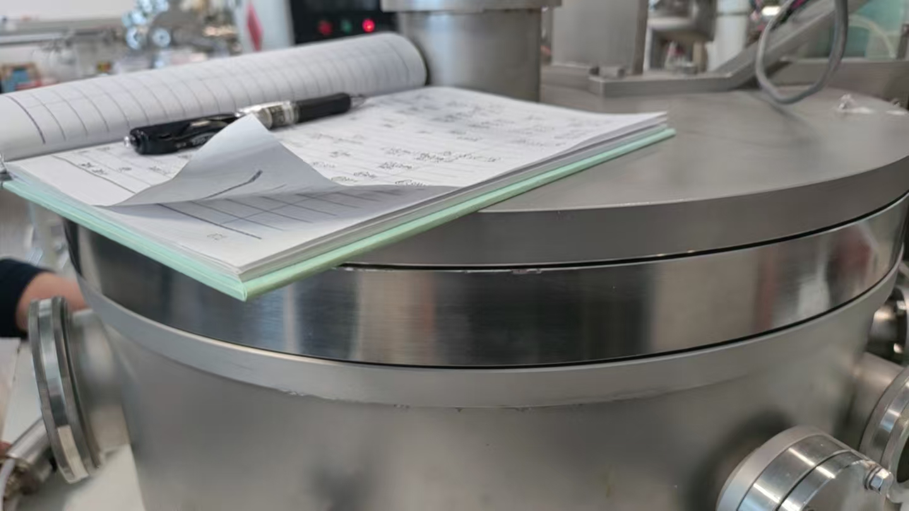
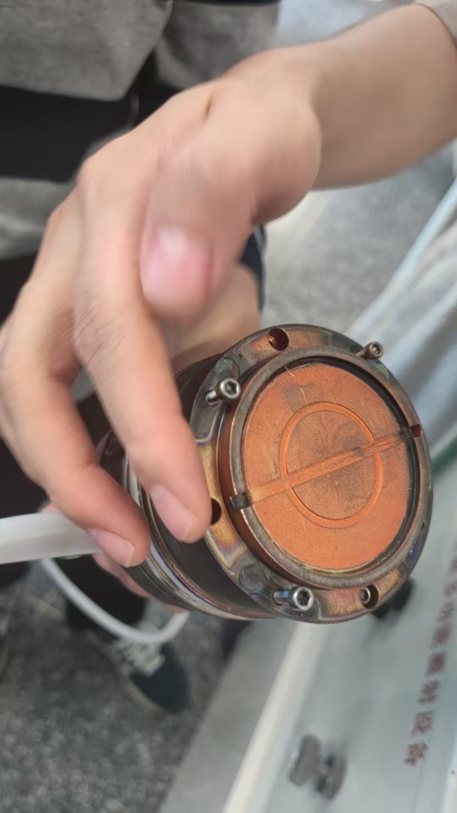
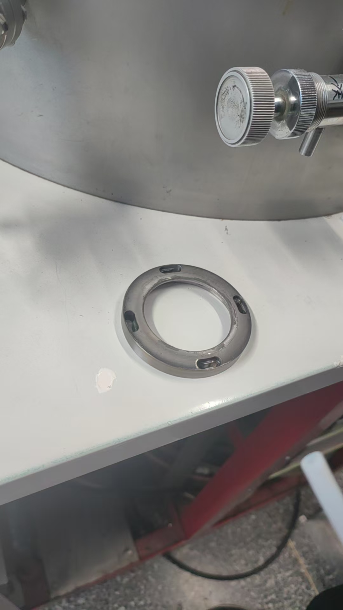

# 2026-05-21 磁控溅射长厚膜设备技巧 session

## 基本信息

- 时间：2026-05-21 下午。
- 地点：M 楼蔡老师实验室。
- 参与人员：我、胡清雨、刘健飞、蔡老师。
- 主题：复盘磁控溅射仪在长厚膜实验中的使用技巧、维护注意事项和风险检查点。

## 本次记录定位

- 本次不是标准 SOP 全流程记录，而是记录蔡老师强调的现场经验技巧。
- 重点场景是 FeGaB / Ta 长厚膜实验，尤其是单片样品沉积约 1 um 量级的情况。
- 这些技巧主要服务于设备稳定性、颗粒控制、冷却安全和避免短路。

## 长厚膜前检查清单

1. 检查当前靶位对应循环水表齿轮是否连续、顺畅转动。
2. 若需要判断真实真空，关闭 Ar 手阀后继续抽约十来分钟再读数。

## 长厚膜中检查清单

1. 持续观察当前靶位对应的循环水表。
2. 若循环水表齿轮不转，或转动明显卡顿，应先停止长膜。
3. 循环水异常时，通知蔡老师或实验室师姐查看，不应继续沉积。

## 长厚膜后清理清单

1. 出样后清理靶枪、靶枪上方隔离罩和几片挡板。
2. 清理工具可以是刀片、镊子或磁控溅射仪专用吸尘器。
3. 厚膜实验建议每完成 1-2 片样品后清理一次。
4. 保险起见，可以每完成 1 片厚膜样品就清理一次。
5. 对于较薄样品，清理频率可以降低，大约 4-5 片样品清理一次。
6. 取完样品后，在盖板重新盖下来的过程中，检查盖板与腔室之间的大垫块是否位置均匀。
7. 清理完成并重新装好隔离罩后，检查隔离罩与靶材之间是否保持约 1 mm 间隙，不能接触短路。

## 典型 FeGaB / Ta 参数

### FeGaB

- 靶位：B 路。
- 功率：射频 100 W。
- 气压：0.5 Pa。
- Ar 流量：约 35 sccm。
- 典型沉积速率：约 0.15 nm/s。
- 常见沉积厚度：通常为 1 um 以上。

### Ta

- 靶位：C 路。
- 电流：0.5 A。
- 典型沉积速率：约 100 s 长 5 nm，约 0.05 nm/s。

### 叠层结构

- FeGaB 厚膜通常采用叠层结构。
- 典型单元：FeGaB 200 nm + Ta 2 nm。
- 重复堆叠上述单元，直到达到目标总厚度。
- 具体沉积时间根据目标厚度和沉积速率决定。

## 靶位与循环水通道

- A：目前不用。
- B：常用，对应 FeGaB 靶。
- C：常用，对应 Ta 靶。
- D：目前也没用过。

使用规则：

- 使用 FeGaB 靶时，重点观察 B 路循环水表。
- 使用 Ta 靶时，重点观察 C 路循环水表。
- 长样品前和长样品过程中都要观察循环水表。
- 正常情况下，水表上方齿轮应连续、顺畅转动。
- 若齿轮不转或转动卡顿，应先停止长膜，并通知蔡老师或实验室师姐查看。

图片证据：

## 盖板垫块检查

背景：

- 该磁控溅射设备购买年限较久。
- 设备最初购买时，不确定上方盖板与下方腔室之间保持多大距离最合适。
- 因此，盖板和下方腔室之间有一块较大的垫块。

现场经验技巧：

- 每次升降上方盖板时，垫块都可能发生轻微挪动。
- 重点检查时机是长完膜、取完样品后，盖板重新盖下来的过程中。
- 盖板下降时，最好用手环抱检查一圈垫块相对腔体边缘的位置。
- 检查重点是垫块是否存在局部凸出或凹陷。
- 如果发现凸出或凹陷，应手动推正垫块。
- 推正后的判断标准：四周缝隙大致均匀，肉眼观察不凸出，不阻碍盖板下降。

现场判断：

- 该检查属于老设备使用经验，不是沉积 recipe 参数。
- 目的应是避免垫块位置偏移导致盖板与腔室间距或受力状态不均匀。

图片证据：

## 破真空与真实真空判断

### 破真空前的 Ar 手阀保护

操作要求：

- 在向腔室注入空气实现破真空时，应先关闭氩气阀。
- 这里的氩气阀指 Ar mass flow/controller 前后的某个手阀。

原因判断：

- 如果破真空时 Ar 手阀未关闭，腔室与气路之间存在真空度差异，可能导致空气漏入 Ar 阀或 Ar 管路中。

### 真实真空读数

操作要求：

- 查看真实真空状态前，应关闭 Ar 手阀。
- 关闭 Ar 手阀后继续抽真空约十来分钟，再读取真空数值。

原因判断：

- 若未关闭 Ar 手阀，或关闭后等待时间不够，真空读数可能不代表腔室真实真空状态。

## 靶枪、隔离罩和挡板清理

操作时机：

- 每次长膜完成并出样后检查。
- 对厚膜样品，建议每完成 1-2 片样品清理一次；保险起见可每片清理一次。
- 对较薄样品，约 4-5 片样品清理一次即可。

清理对象：

- 靶枪本体。
- 靶枪上方隔离罩。
- 几片挡板。

清理方式：

- 可使用刀片、镊子或吸尘器清理颗粒。
- 计划购买一个吸力较强的吸尘器，作为磁控溅射仪专用清理设备。
- 该吸尘器、吸嘴和管路应尽量专机专用，避免引入交叉污染。

原因判断：

- 长厚膜过程中靶材和挡板附近更容易积累脱落颗粒。
- 若颗粒积累过多，可能落到后续生长样品上，影响薄膜质量。

风险与边界：

- 如果颗粒吸不走，最后办法是把靶取下来清理。
- 但强磁性靶拆卸非常不容易。
- 拆靶不小心可能导致靶材变形或断裂，因此应作为最后手段。
- 清理应在完全破真空后进行。
- 破真空后腔室通常已接近常温，但仍应避免在明显高温风险下操作。

图片证据：

## 隔离罩安装要求

- 该部件现场称为“隔离罩”。
- 隔离罩安装在靶材上方。
- 安装完成后，隔离罩与靶材之间应保持约 1 mm 间隙。
- 隔离罩不能与靶材直接接触，否则可能导致短路。
- 重点检查时机是长完膜、完成清理并重新装好隔离罩后。
- 装好后需要检查隔离罩位置、间隙和电接触风险。

图片证据：

## 本次结论

- 本次向蔡老师学习的重点，是长厚膜实验中的设备维护和异常预防，而不是单一 recipe。
- 对 FeGaB / Ta 厚膜实验，主要风险集中在颗粒堆积、循环水异常、隔离罩短路、Ar 气路保护和老设备机械结构偏移。
- 后续每次做 1 um 量级厚膜时，应把“循环水表、Ar 手阀、出样后清理、盖板下降时垫块检查、清理后隔离罩间隙检查”作为固定检查项。

## 待确认事项

- 设备型号或系统正式名称。
- Ar 手阀的具体物理位置是否需要再拍一张图。
- 若后续采购磁控专用吸尘器，应记录型号、吸嘴形式和专用存放位置。
