# Red Pitaya + TOPTICA 微腔自动锁模 session

## 当前状态

本 session 记录 Red Pitaya/PyRPL + TOPTICA DLC PRO + 微腔透射信号的半自动锁模流程开发。当前目标不是完全黑箱无人值守，而是形成一套现场可观察、可复盘、可逐步接管的锁模流程。

当前主线已经收口为：

```text
fresh sweep
-> ARC/PC pretune
-> platform-drop 1/4 apparent full width 判断可捕获宽度
-> dip-rise 1/4 计算 PID 锁点
-> PID handoff
-> monitor 判读
-> session.md 记录
```

后续新线程复用入口：

```text
workspace/skills/auto-lock-redpitaya-microcavity/SKILL.md
```

推荐新线程提示词：

```text
继续使用 workspace/skills/auto-lock-redpitaya-microcavity/SKILL.md 里的 Red Pitaya + TOPTICA 微腔锁模流程，先读当前 session，再按里面的主线脚本操作。
```

原始探索长记录已归档到：

```text
archive_exploration_2026-05-25_to_26.md
```

## 系统与信号链

### 硬件与软件

| 项目 | 当前状态 |
|---|---|
| Red Pitaya IP | `192.168.1.34` |
| 控制软件 | PyRPL 0.9.8.0 + 本地 live bridge |
| PyRPL bridge | `http://127.0.0.1:7870` |
| TOPTICA 激光器 | DLC PRO |
| TOPTICA IP | `192.168.1.104` |
| 激光器可调参数 | PC Piezo voltage、external input `ARC factor` |
| 当前主线脚本 | `scripts/fast_lock_with_pretune.py` |

### 通道含义

| 通道 | 物理/软件含义 | 用途 |
|---|---|---|
| `in1` / scope `CH1` | 光电探测器透射信号 | 模式识别、锁点判断、锁定质量评价 |
| `out2` / scope `CH2` | Red Pitaya 输出到激光器控制端的控制电压 | 扫频、PID 输出、`ival` 观察 |
| `asg0` | 约 50 Hz ramp，输出到 `out2` | 动态扫频找模式 |
| `asg1` | 同频方波，不接物理输出 | scope 触发源 |
| `pid0.input` | `in1` | PID 读取透射信号 |
| `pid0.output_direct` | `out2` | PID 接管激光器控制端 |

已验证扫频链路：

```text
asg0.output_direct = out2
asg0.waveform      = ramp
asg0.amplitude     = 0.5        # PyRPL 中为峰值，对应约 1 Vpp
asg0.frequency     ≈ 49.94 Hz

asg1.output_direct = off
asg1.waveform      = square
asg1.amplitude     = 0.5
asg1.frequency     ≈ 49.94 Hz

scope.trigger_source = asg1
scope.duration       ≈ 0.067 s  # 约 3 个扫频周期
```

关键判断：

- `CH1` 是透射信号。
- `CH2/out2` 是扫频或 PID 控制电压。
- 正式锁模前必须重新采集当前扫频图，不能沿用旧模式、旧耦合或旧偏振状态下的锁点。

## 当前推荐操作流程

### 快速命令

在 session 根目录执行：

```powershell
cd C:\Users\win10\Desktop\daily_note_v2\workspace\experiments\2026-05-22\auto_lock_redpitaya_microcavity

C:\Users\win10\toptica_lasersdk_venv\Scripts\python.exe scripts\fast_lock_with_pretune.py `
  --tag <meaningful_tag> `
  --max-pretune-iterations 10 `
  --max-fractional-step 0.50 `
  --monitor-seconds 5 `
  --p 0.01 `
  --i 10
```

只有在已知自动 handoff 方向错误或刚刚因为方向错误触发饱和时，才显式加：

```text
--initial-ival <value>
```

### 流程步骤

1. 打开 ASG 扫频，重新采集当前模式的 scope trace。
2. 默认只分析三角波下扫段，减少上下扫滞后和重复 dip 干扰。
3. 识别平台、dip、apparent full width 和 lockpoint。
4. 若 dip center 不接近 `Out2 = 0`，先调 TOPTICA PC Piezo。
5. 若 dip 已基本居中但 apparent full width 不在允许范围，再调 ARC factor。
6. 用 fresh sweep 重新计算 dip-rise 1/4 锁点。
7. 关闭 ASG，设置 `pid0.ival`、`pid0.setpoint`、P、I，进入 PID handoff。
8. 采集 5 s monitor。
9. 分别看全段和去掉 handoff 首帧后的稳定段。
10. 与用户一起判断结果是否可接受，再写入 `session.md`。

### 安全边界

- `global_config`、`new123456`、`try.yml` 等 GUI 配置视为用户手动调试配置，自动化脚本不得直接改写。
- 当前主线通过 live bridge 控制 GUI 可见的 PyRPL 状态，不再沿旧版 PyRPL/Qt/pyqtgraph 补丁路线推进。
- 若 `out2` 接近 `±1 V` 或 `pid0.ival` 接近 `±4 V`，视为可能饱和，不得判断为稳定锁定。
- 若 PyRPL bridge、TOPTICA SDK、CH1/CH2 含义或输出状态不确定，先停下来确认，不继续扫参。

## 判据与参数

### apparent linewidth

当前脚本里的 linewidth 是模式在 `Out2/ival` 控制电压轴上的 apparent linewidth，不是光学真实 Q 或频率 FWHM。

原因：

```text
真实高 Q 模式 + 较小扫频增益
  -> 在 Out2 控制电压轴上也可能看起来较宽

真实低 Q 模式 + 较大扫频增益
  -> 在 Out2 控制电压轴上也可能看起来较窄
```

真实 Q 需要频率轴标定，例如激光调谐系数、EOM 边带、FSR 或其他已知频率间隔。

### 预调宽度

ARC/full-width 预调使用 platform-drop 1/4 宽度：

```text
T_width = T_platform - 0.25 * (T_platform - T_min)
        = T_min + 0.75 * (T_platform - T_min)
```

当前默认窗口：

```text
min_full_width = 0.08 V
target_full_width = 0.10 V
max_full_width = 0.24 V
```

解释：

- `min_full_width = 0.08 V`：保留高 Q 模式的最低可接受宽度，不强迫其变宽。
- `target_full_width = 0.10 V`：作为 ARC 调整参考目标。
- `max_full_width = 0.24 V`：允许低 Q 模式以较宽 apparent linewidth 通过预调，避免强行压窄模式并推高 ARC factor。

### PID 锁点

实际 PID 锁点使用 dip-rise 1/4：

```text
T_lock = T_min + 0.25 * (T_platform - T_min)
```

注意：platform-drop 1/4 用于宽度预判，dip-rise 1/4 用于 PID setpoint，二者不能混用。

### `initial_ival`

`initial_ival` 是 PID handoff 前给积分器的起始控制电压，不是物理测量参数。

若命令行未显式传入，脚本按锁点所在的 `Out2` 位置自动估算：

```text
lock_center <= 0 -> +platform_ival
lock_center > 0  -> -platform_ival
```

其中 `platform_ival` 默认是 `0.95 V`。若现场发现自动方向会导致饱和，应手动传 `--initial-ival` 覆盖。

## 当前代码分工

### 主线代码

| 脚本 | 当前用途 |
|---|---|
| `scripts/fast_lock_with_pretune.py` | 主入口：扫当前模式、ARC/PC 预调、识别锁点、PID handoff、monitor、保存结果 |
| `scripts/pyrpl_live_bridge.py` | PyRPL GUI + 本地 HTTP bridge，供脚本读写 Red Pitaya 状态 |
| `scripts/suggest_arc_factor.py` | scope 采集、下扫段分析、dip/宽度/锁点识别、prelock 图 |
| `scripts/tune_arc_fullwidth_center.py` | TOPTICA ARC factor 和 PC Piezo 读写 |

### 辅助诊断代码

| 脚本 | 用途 |
|---|---|
| `scripts/run_seconds_pid_lock_sweep.py` | 静态 probe、进入方向诊断、P/I 扫参、完整锁模时间线 |
| `scripts/monitor_pid_state.py` | 已经锁住后的独立短时或更长 monitor |
| `scripts/test_arc_factor_lock_series.py` | 多个 ARC factor 的对比测试和结果整理 |
| `scripts/auto_tune_arc_factor.py` | 早期自动调 ARC factor；当前能力已并入主线思路 |

### 历史探索代码

以下脚本可保留作历史参考，但不作为日常入口：

```text
scripts/rp_scope_ui.py
scripts/run_dynamic_ival_search.py
scripts/run_directional_prelock.py
scripts/run_adaptive_pid_tune.py
scripts/ramp_i_after_capture.py
scripts/fast_lock_from_prelock.py
```

这些脚本对应早期探索阶段：手动找方向、动态 `ival` 搜索、旧式 adaptive PID、临时 UI 或从已有 prelock 文件快速接管。当前主线已经收敛到 `fast_lock_with_pretune.py`。

## 关键结果与证据链

### 1. ARC/PC 预调和 dip-rise 锁点定义

有效预调结果：

| 参数 | 数值 |
|---|---:|
| ARC factor | 4.35 |
| PC Piezo set voltage | ≈71.765 V |
| dip center on Out2 | ≈-0.003662 V |
| platform-drop 1/4 full width | ≈0.109714 V |
| capture width | ≈0.042036 V |

代表图：

```text
results/pyrpl_live_bridge/platform_drop_fullwidth_gt_0p1_20260526_225852_iter05_arc_width.png
```

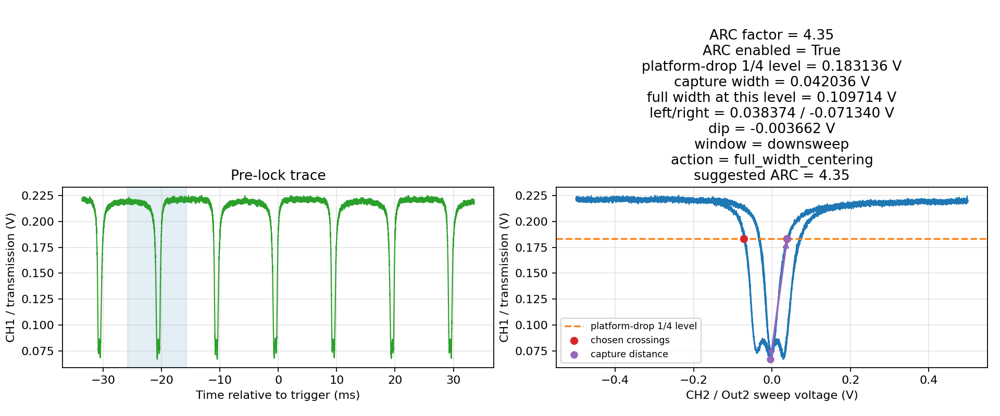

dip-rise 1/4 锁点识别：

| 参数 | 数值 |
|---|---:|
| `T_lock` | ≈0.1060486 V |
| platform-side Out2 at dip-rise 1/4 | ≈+0.067699 V |
| dip center Out2 in fresh sweep | ≈+0.054077 V |
| full width at dip-rise 1/4 level | ≈0.052176 V |
| capture width | ≈0.013622 V |

代表图：

```text
results/pyrpl_live_bridge/dip_rise_quarter_lockpoint_20260526_230329_arc_width.png
results/pyrpl_live_bridge/dip_rise_quarter_lockpoint_20260526_230329_lockpoint.png
```

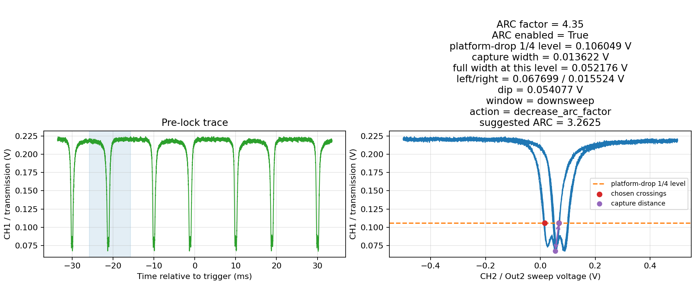

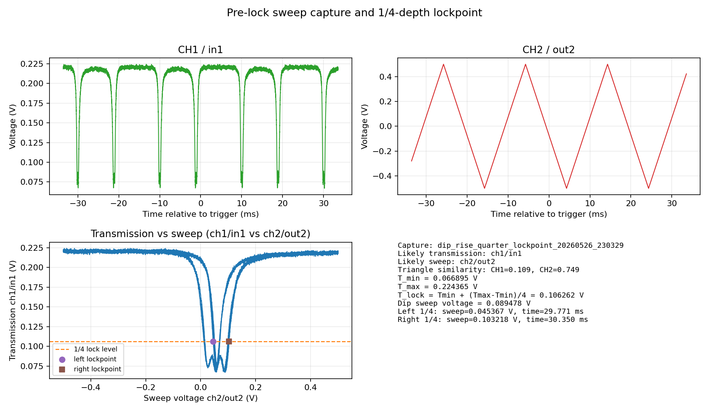

判断：

- ARC/PC 预调可以把模式调到 `Out2≈0 V` 附近，并使 platform-drop 1/4 full width 达到约 0.1 V。
- 真正 PID 锁点应使用 dip-rise 1/4，不能直接拿 platform-drop 1/4 width level 当锁点。

### 2. PID 接管和 6 s 短时监控

静态 probe 显示减小 `ival` 时 CH1 更接近目标，因此该轮应向负方向进入模式。

有效 PID 参数：

| 参数 | 数值 |
|---|---:|
| P | -0.0078125 |
| I | -4.997947940025335 |
| output | out2 |

锁后 6 s monitor：

| 参数 | 数值 |
|---|---:|
| target | 0.1060486 V |
| CH1 mean | 0.1052612 V |
| mean error | -0.0007874 V |
| CH1 min/max | 0.093628 / 0.115967 V |
| CH1 ptp | 0.0223389 V |
| CH1 std | 0.0076860 V |
| CH2 ptp | ≈0.005005 V |
| `ival` drift | ≈-0.006348 V |

代表图：

```text
results/pyrpl_live_bridge/dip_rise_quarter_lock_20260526_230355.png
```

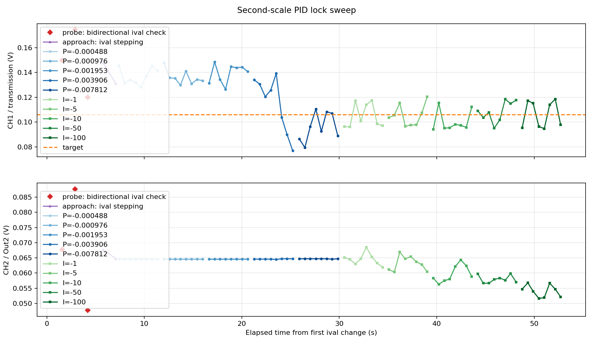

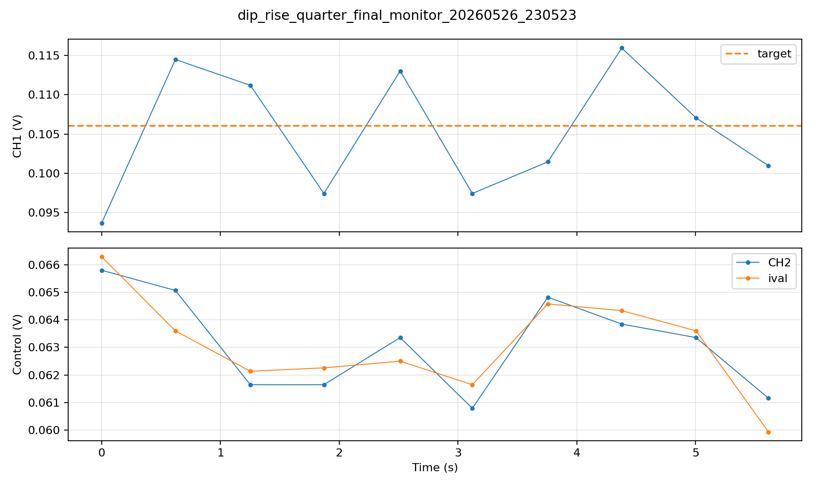

判断：

- 该轮 P/I 能把 CH1 均值拉到目标附近。
- 6 s 内均值误差约 -0.8 mV，短时漂移很小。
- CH1 仍有约 22 mV 峰峰波动，不能据此证明长期稳定或实际测量 SNR 最优。

### 3. 三档 ARC factor 对比

本轮测试：

```text
3.2625, 4.35, 5.8
```

代表结果目录：

```text
results/pyrpl_live_bridge/arc_factor_lock_series_20260527_20260527_164258/
```

结果摘要：

| ARC factor | platform-drop 1/4 capture width | dip-rise 1/4 lock CH1 | probe center Out2 | 锁定结果 |
|---:|---:|---:|---:|---|
| 3.2625 | 0.05899 V | 0.08765 V | -0.34592 V | P 阶段失败，未找到 non-problematic P |
| 4.35 | 0.03808 V | 0.09207 V | -0.18899 V | 可锁定，但短时波动较大 |
| 5.8 | 0.03185 V | 0.09381 V | -0.08748 V | 本轮最终选中 |

最终选中组：

| 参数 | 数值 |
|---|---:|
| P | -0.0009765625 |
| I | -49.99800747417374 |
| target CH1 | 0.09381103515625 V |
| CH1 mean | 0.09232584635416667 V |
| mean error | -0.0014851888020833287 V |
| CH1 ptp | 0.0130615234375 V |
| CH1 std | 0.0046502576553807354 V |

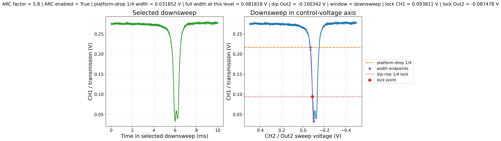

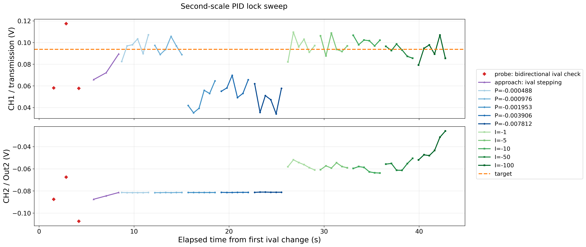

判断：

- `ARC=5.8` 在当时模式/耦合状态下可完成自动 probe、进入模式、P/I 接管。
- `ARC=4.35` 也可锁，但短时 CH1 峰峰值更大。
- `ARC=3.2625` 虽然 pre-lock 宽度更大，但进入路径不可靠，说明“更宽”不必然更好。

### 4. fast pretune 自动预调复测

背景：`max_pretune_iterations=6`、`max_fractional_step=0.35` 时，脚本把 dip 基本居中，但 full width 仍低于 `0.08 V`，未进入 PID handoff。

改用：

```text
max_pretune_iterations = 10
max_fractional_step = 0.50
monitor_seconds = 5
P = +0.010009765625
I = +10.000527898530768
```

代表文件：

```text
results/pyrpl_live_bridge/fast_pretune_lock_20260527_20260527_201033/
results/pyrpl_live_bridge/fast_pretune_lock_20260527_20260527_201528/
```

两次复测结果：

| 结果目录 | ARC factor | PC voltage_set | full width | dip Out2 | target CH1 | 结果 |
|---|---:|---:|---:|---:|---:|---|
| `201033` | 4.462656 | 77.7842 V | 0.10456 V | 0.02197 V | 0.17490 V | 进入 handoff |
| `201528` | 4.419314 | 78.7216 V | 0.10567 V | 0.01611 V | 0.17728 V | 进入 handoff |

去掉第一帧 handoff 瞬态后：

| 结果目录 | CH1 mean | CH1 ptp | CH2 ptp | `ival` drift |
|---|---:|---:|---:|---:|
| `201033` | 0.17208 V | 0.02100 V | 0.00281 V | -0.00183 V |
| `201528` | 0.17614 V | 0.02246 V | 0.01147 V | -0.01038 V |


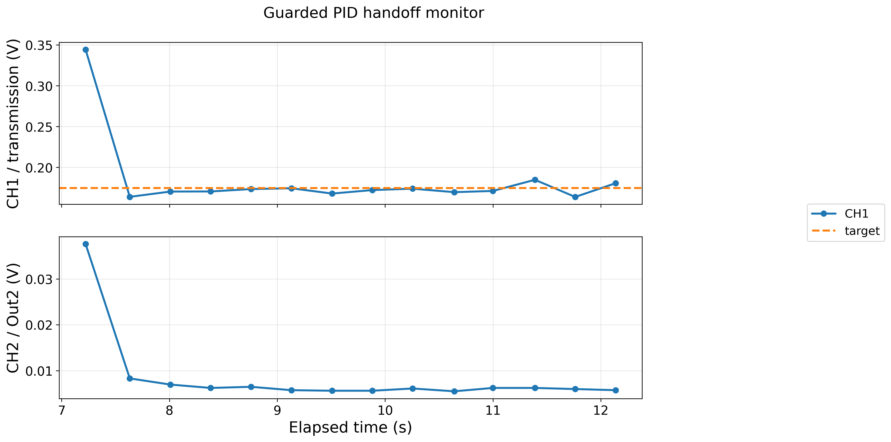

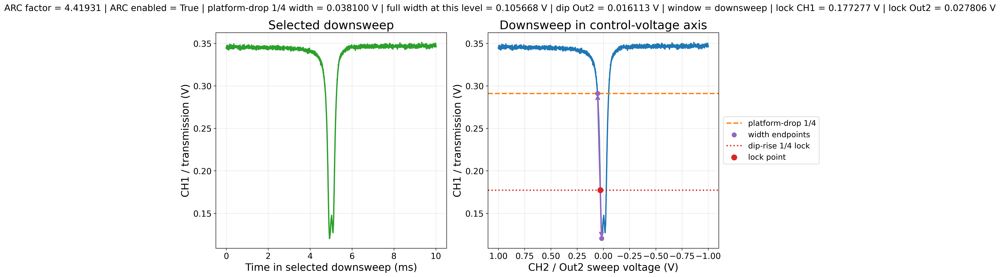

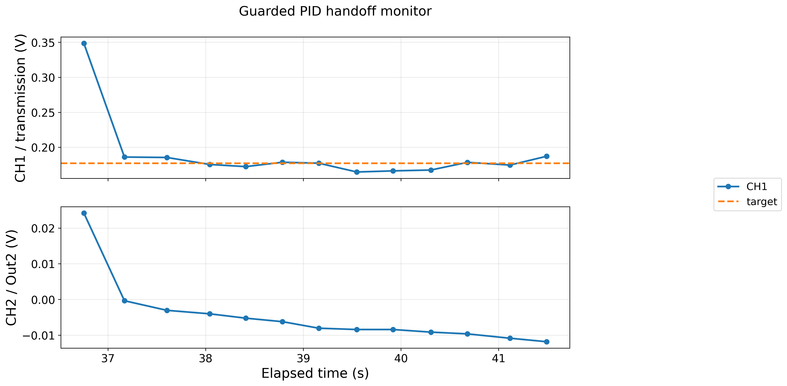

判断：

- `max_pretune_iterations=10` 和 `max_fractional_step=0.50` 让 ARC/PC 预调能够稳定进入 PID handoff。
- handoff 第一帧大是正常瞬态，不应直接作为失败证据。
- 去掉首帧后，CH1 mean 接近 target，短时可用，但仍不能证明长期稳定或实际测量 SNR。

### 5. 不进模式本底对照

目的：判断锁后 CH1 涨落是否只是读数/平台本底。

本底采集方式：

```text
asg0.output_direct = off
pid0.i = 0
pid0.p = 0
pid0.output_direct = off
seconds = 5
interval = 0.1
```

代表图：

```text
results/pyrpl_live_bridge/no_mode_baseline_20260527_20260527_202519.png
```

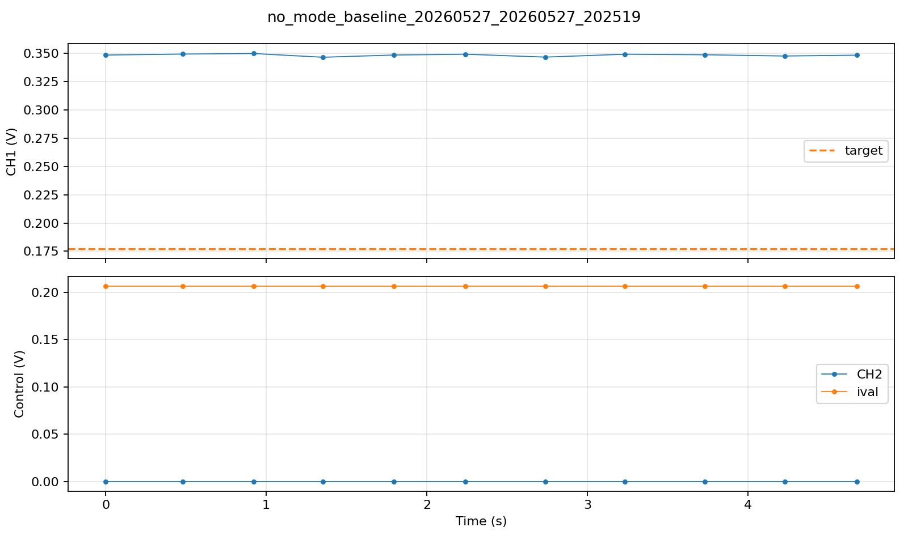

| 状态 | n | CH1 mean | CH1 RMS fluct. | CH1 ptp | CH2 RMS fluct. | CH2 ptp |
|---|---:|---:|---:|---:|---:|---:|
| `201033` 锁后，去首帧 | 13 | 0.17208 V | 0.00562 V | 0.02100 V | 0.00072 V | 0.00281 V |
| `201528` 锁后，去首帧 | 12 | 0.17614 V | 0.00730 V | 0.02246 V | 0.00325 V | 0.01147 V |
| 不进模式本底 | 11 | 0.34856 V | 0.00102 V | 0.00330 V | 0 V | 0 V |

判断：

- 不进模式时 CH1 平台本底约 1.0 mV RMS、3.3 mV ptp。
- 锁后 CH1 涨落明显高于平台本底，主要反映锁在模式斜坡/反馈状态下的真实短时波动。

### 6. 锁点比例扫描

目的：测试锁点取在 dip 到平台透过率差的不同上升比例处时，是否都能锁上，以及短时涨落是否相近。

比例定义：

```text
T_lock = T_dip + ratio * (T_platform - T_dip)
```

脚本新增参数：

```text
--lock-depth-fraction
--initial-ival
```

代表结果目录：

```text
results/pyrpl_live_bridge/lockdepth_p2of3_20260527_20260527_203214/
results/pyrpl_live_bridge/lockdepth_p1of2_20260527_20260527_203250/
results/pyrpl_live_bridge/lockdepth_p1of3_initial_neg095_20260527_20260527_203511/
results/pyrpl_live_bridge/lockdepth_p1of4_initial_neg095_20260527_20260527_203525/
results/pyrpl_live_bridge/lockdepth_p1of5_initial_neg095_20260527_20260527_203535/
```

结果表中 monitor 数字均为去掉 handoff 第一帧后的短时稳定段：

| ratio | 是否锁上 | initial ival | target CH1 | lock Out2 | stable CH1 mean | mean error | CH1 RMS fluct. | CH1 ptp | CH2 ptp | `ival` drift |
|---:|---|---:|---:|---:|---:|---:|---:|---:|---:|---:|
| 2/3 | 是 | 自动 | 0.27840 V | 0.04453 V | 0.27853 V | +0.00013 V | 0.00357 V | 0.01111 V | 0.01697 V | -0.01697 V |
| 1/2 | 是 | 自动 | 0.24146 V | 0.01173 V | 0.23930 V | -0.00216 V | 0.00592 V | 0.01843 V | 0.01318 V | -0.01233 V |
| 1/3 | 是 | -0.95 V | 0.21021 V | 0.02689 V | 0.20701 V | -0.00319 V | 0.00960 V | 0.03699 V | 0.01404 V | +0.00049 V |
| 1/4 | 是 | -0.95 V | 0.19131 V | 0.02495 V | 0.19012 V | -0.00119 V | 0.00907 V | 0.02710 V | 0.02588 V | +0.01025 V |
| 1/5 | 是 | -0.95 V | 0.18115 V | 0.03195 V | 0.18135 V | +0.00019 V | 0.00657 V | 0.02380 V | 0.00745 V | +0.00378 V |

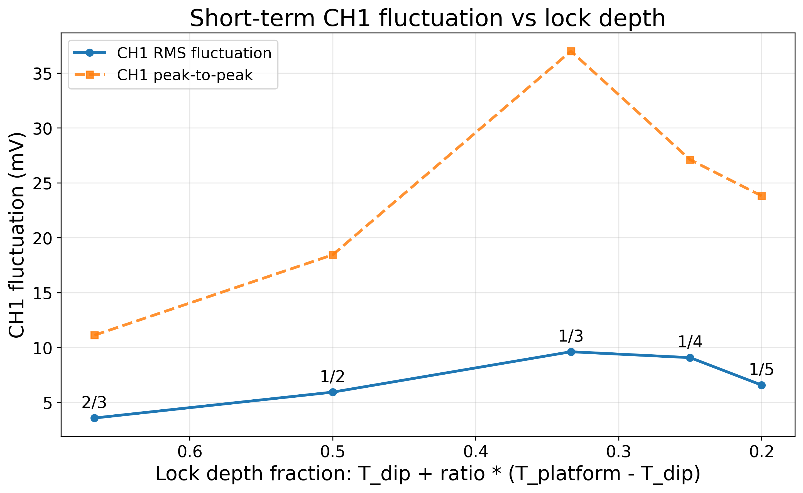

判断：

- `2/3` 最稳，`1/3` 和 `1/4` 的 CH1 RMS fluct. 较大，锁点位置与短时涨落不是简单单调关系。
- 初次直接扫描中，`1/3`、`1/4`、`1/5` 曾因 handoff 方向错误触发饱和；显式设置 `initial_ival=-0.95 V` 后可锁。
- 本轮只说明这些比例在 5 s 窗口内可锁，不说明长期稳定性或实际测量 SNR。

### 7. 低 Q 模式 full-width 窗口调整

现场换到低 Q 模式后，用户指出旧窗口 `0.08-0.12 V` 偏小，且过高 ARC factor 不理想。现场 trace 支持该判断：在 `ARC=25` 时，当前低 Q 模式的 platform-drop 1/4 full width 已约 0.259 V；若沿用旧窗口，脚本倾向于把 ARC factor 增大来压窄模式。

对照测试：

| 窗口 | target | 最终 ARC | final full width | 是否锁上 | 去首帧 CH1 RMS fluct. | 去首帧 CH1 ptp |
|---|---:|---:|---:|---|---:|---:|
| `0.20-0.32 V` | 0.25 V | 25.0 | 0.22992 V | 是 | 0.00158 V | 0.00549 V |
| `0.08-0.12 V` | 0.10 V | 45.5625 | 0.11620 V | 是 | 0.00204 V | 0.00623 V |

代表结果：

```text
results/pyrpl_live_bridge/lowQ_wide_width_lock_20260527_20260527_204944/
results/pyrpl_live_bridge/lowQ_old_width_lock_20260527_20260527_205016/
```

判断：

- 旧窗口也能锁，但会把 ARC factor 从 25 推到 45.56，且 handoff 首帧瞬态更明显。
- 对低 Q 模式，旧窗口偏小；更大的最大允许宽度能保留较低 ARC factor，handoff 更自然。
- 最终默认值不提高 `min_full_width`，只放宽 `max_full_width` 到 0.24 V。

### 8. 低 Q 模式复测

目的：验证 `min_full_width=0.08 V`、`target_full_width=0.10 V`、`max_full_width=0.24 V` 的默认策略能否在当前低 Q 横模下自然锁定，并避免继续推高 ARC factor。

运行参数：

```text
scripts/fast_lock_with_pretune.py
--tag lowQ_repeat_lock_20260527
--max-pretune-iterations 10
--max-fractional-step 0.50
--monitor-seconds 5
--p 0.01
--i 10
```

代表结果：

```text
results/pyrpl_live_bridge/lowQ_repeat_lock_20260527_20260527_212857/
results/pyrpl_live_bridge/lowQ_repeat_lock_20260527_20260527_212857/final_prelock_downsweep_width_lock.png
results/pyrpl_live_bridge/lowQ_repeat_lock_20260527_20260527_212857/handoff_monitor.png
```

预调结果：

| 参数 | 数值 |
|---|---:|
| ARC factor | 25.0 |
| PC voltage_set | 88.7218 V |
| platform-drop 1/4 full width | 0.23182 V |
| dip center Out2 | 0.00732 V |
| target CH1 | 0.20563 V |
| lock Out2 | 0.04453 V |

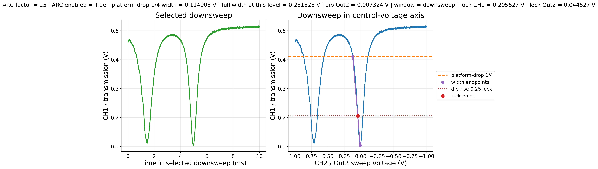

5 s handoff monitor：

| 指标 | 全段 monitor | 去掉 handoff 首帧后 |
|---|---:|---:|
| n | 13 | 12 |
| CH1 mean | 0.21375 V | 0.20465 V |
| CH1 ptp | 0.12097 V | 0.00525 V |
| CH1 RMS fluct. | 0.03153 V | 0.00142 V |
| CH2 ptp | 0.01477 V | 0.00806 V |
| `ival` drift | -0.01013 V | -0.00708 V |

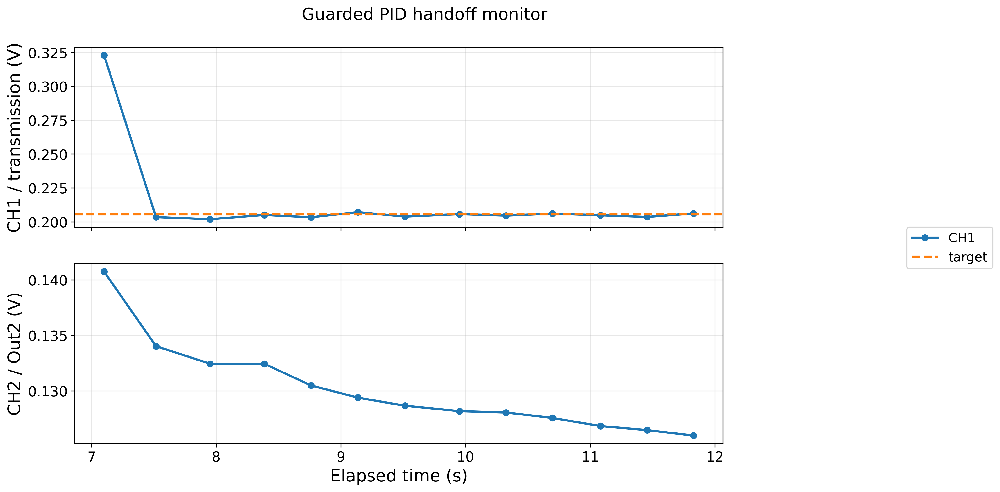

结束后实时读回：

```text
pid0.output_direct = out2
pid0.p = 0.010009765625
pid0.i = 10.000527898530768
pid0.ival ≈ 0.05286 V
pid0.setpoint ≈ 0.20557 V
asg0.output_direct = off
scope.voltage_in1 ≈ 0.20642 V
scope.voltage_in2 ≈ 0.05151 V
```

判断：

- 本轮 `ok=true`，没有触发 Out2 或 `ival` 饱和保护。
- ARC factor 保持在 25.0，没有被脚本继续推高。
- 去掉 handoff 首帧后，CH1 均值贴近 target，RMS fluct. 约 1.4 mV、ptp 约 5.3 mV。
- 用户认为结果“还可以”，因此本轮可作为当前低 Q 模式下可接受的短时锁定结果。
- 证据仍是单个模式的 5 s 短时结果，不能替代更长时间 monitor 或实际测量信号 SNR 验证。

## 非主线内容与数据整理建议

### 不再作为主线的内容

以下内容不再作为当前自动锁模主线：

| 内容 | 当前处理 |
|---|---|
| Red Pitaya 官方网页示波器 | 可打开但连接不稳定，不作为主调试界面 |
| 本地轻量 SCPI 示波器 | UI 可跑但 SCPI/刷新稳定性不足，不作为主线 |
| 旧版 PyRPL GUI 修复 | 兼容性复杂，容易闪退或报错，不再推进 |
| 早期动态 `ival` 搜索 | 作为“锁点和 dip 会随偏振/耦合变”的证据，不作为日常入口 |
| gain=5 / gain=25 早期手动锁模测试 | 作为 apparent linewidth 和 P/I 调参经验，不作为当前参数依据 |
| `I=-1000` 测试 | 作为积分过大导致饱和的失败案例 |

### 不建议提交到 Git 的内容

除非后续明确需要复盘原始波形，否则以下文件不建议提交：

- 早期探索产生的大量 `.npz`。
- 临时 `*_lockpoint.png`，尤其是已被 summary 图或精选图替代的旧图。
- `live.log`、`live.err`、临时调试输出。
- 非最终选中参数组的大量中间 CSV/JSON/PNG。
- 仪器 GUI 自动保存配置、用户手动调试配置、缓存和运行产物。

建议提交：

- `session.md`。
- 当前主线脚本和必要辅助脚本。
- `workspace/skills/auto-lock-redpitaya-microcavity/SKILL.md`。
- 被 `session.md` 明确引用的精选 PNG。
- 被 `session.md` 明确引用的精选图。

## 当前欠缺与后续检查

当前流程已经足够先服务后续测量，但仍欠以下验证：

- 长时间稳定性：目前主要是 5-6 s 级别 monitor，正式测量前建议补 10-30 s 或更长 monitor。
- 实际测量 SNR：锁住不等于测量变好，需要看目标信号幅度、噪声 PSD、SNR，以及反馈是否压掉低频信号。
- 多模式重复性：低 Q `max_full_width=0.24 V` 策略已有一轮复测支持，但还需要更多高 Q/低 Q/不同耦合状态验证。
- 频率轴标定：当前 apparent linewidth 是控制电压轴宽度，不是真实 optical linewidth/Q。
- 安全收尾流程：后续可补一个明确的“关 ASG、关 PID 输出、读回状态”的小流程。
- GitHub 复用整理：当前 session 目录仍需挑选可提交内容，排除原始大数据、日志和临时文件。

## 当前结论

当前自动锁模开发可以先收口。已经形成一套可复用的半自动流程：

```text
重新扫当前模式
-> 用 platform-drop 1/4 apparent full width 做 ARC/PC 预调
-> 用 dip-rise 1/4 计算 PID target
-> PID handoff
-> 5 s monitor
-> 去首帧后判断短时锁定质量
-> 记录事实、现场判断、AI 判断、限制和下一步
```

下一阶段不应继续单纯“调锁模本身”，而应让这套流程服务实际测量，再用测量 SNR、长时间稳定性和多模式重复性来决定是否继续修改脚本或判据。
