# 2026-05-22 Red Pitaya PID 参数对微腔传感器噪声 PSD 的影响

## 基本信息

- 时间：2026-05-22，上午开始。
- 记录类型：测量实验 session。
- 实验对象：封装机箱内 Red Pitaya + DFB 激光器 + 光学衰减器 + 偏振控制器 + 光电探测器，与一个较早前制作的封装微腔超声波传感器组成的光路-电路系统。
- 样品状态：传感器为历史样品，不是本次新制备样品；具体样品编号待确认。
- 核心目标：测量改变 Red Pitaya PID 参数，尤其是积分参数 I，是否会显著改变锁定在光学模式斜边时的噪声功率谱。

## 事实记录

- 机箱内部包含 Red Pitaya、DFB 激光器、光学衰减器、偏振控制器和光电探测器。
- Red Pitaya IP：`192.168.1.34`。
- 激光器上位机串口：`COM5`。
- 光路链路：机箱内 DFB 激光器出射，经偏振控制器和光学衰减器后从机箱出射；光经光纤跳线进入微腔超声波传感器；传感器输出的受调制光再返回机箱内光电探测器。
- 电路/信号链路：光电探测器将光信号转化为电信号，电信号进入 Red Pitaya 进行信号处理。
- Red Pitaya 用途：
  - 信号解调或频谱分析。
  - 使用 PID 功能将激光器波长锁在光学模式一侧，以稳定光路系统。
- 本次先不施加外部超声激励，仅测背景噪声。
- 本次计划只改变 PI 两个参数；D 参数暂不作为主要变量。
- 锁点需要保持一致。
- 其他条件原则上保持不变，包括激光器、光衰减器、偏振控制器、传感器摆放和光纤状态等。

## 图片证据

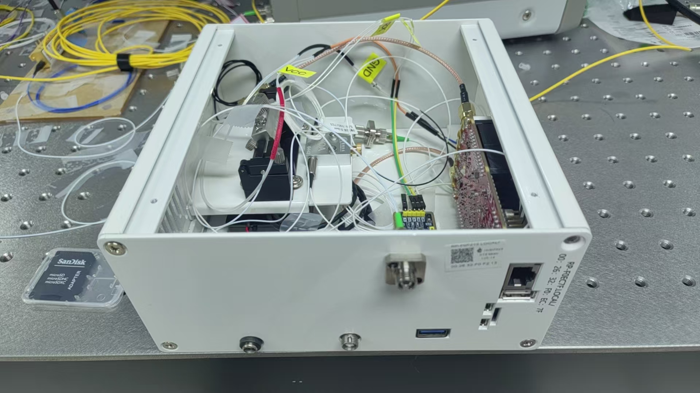

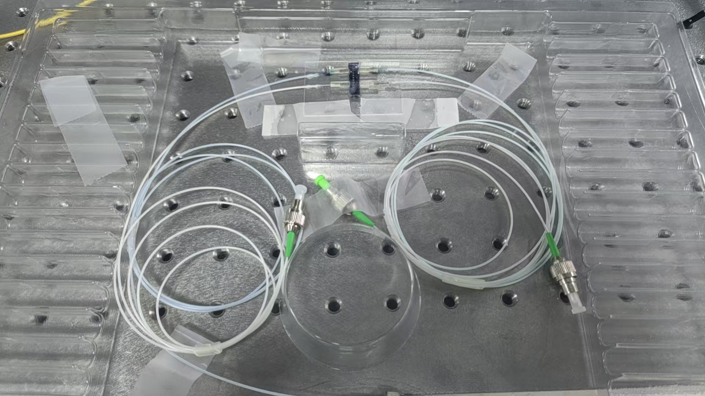

## 测量目标

比较不同 PI 参数下，Red Pitaya 频谱分析仪读取到的光电探测器电信号噪声功率谱，重点判断积分参数 I 是否会在稳定锁模的同时滤去低频噪声。

优先关注：

1. 低频 PSD 随 I 参数变化的趋势。
2. 低频漂移、1/f 噪声或锁定环路引入的额外噪声是否变化。
3. PI 参数改变后是否出现锁定不稳、失锁、低频振荡或谱峰。

目标单位优先记录为 `dB(Vrms^2/Hz)`；如果 Red Pitaya 界面导出或截图单位不同，应原样记录，并在后处理中再统一。

## 变量与控制量

### 自变量

- 主要有效数据组中固定 `P = 0.01`。
- 主要有效数据组中扫描 `I = 1, 5, 10, 50, 100, 500, 1000, 5000, 10000`；其中 `I=1` 初始方向不锁，实际采用 `I=-1` 作为弱反馈参考。
- D 参数未作为变量。
- 上午早期还做过探索性 I sweep 和 P-only sweep，主要用于排错和理解环路行为，不作为最终结论的主要证据。

### 因变量

- `ch1` 光电探测器电信号的时域波动和 AC RMS。
- `ch1` 光电探测器电信号的噪声功率谱，主要关注低频段。
- 主要有效数据组采集 `0-100 kHz` 频谱，并额外绘制 `0-20 kHz` 低频对比。

### 控制量

- 锁定位置：主要有效数据组保持在同一个光学模式的 `1/4` 深度锁点，即约 `0.231 V`。
- 外部超声输入：无。
- 激光器设置：待记录。
- 光衰减器设置：待记录。
- 偏振控制器状态：原则上保持不变，具体状态待记录。
- 传感器摆放和光纤弯曲状态：原则上保持不变。
- 主要有效数据组中使用机箱内部 DFB 激光器、`new123456` 配置的临时运行副本、10 ms scope 数据和频谱平均 `trace_average = 10`。

## 现场判断

- I 参数可能更明显影响长时稳定性，因此本次优先观察低频噪声 PSD 随 I 参数的变化。
- 如果 PI 参数改变后 PSD 发生变化，不能直接解释为微腔光学模式本征噪声改变；更可能同时包含锁定环路带宽、残余频率噪声、激光强度噪声转移、锁点斜率、PD/RP 电子噪声占比等因素。
- 为避免锁点漂移造成误判，每组 PI 参数下都应记录平均 PD 电压、误差信号或 Red Pitaya 显示的锁定状态。

## 接口连通性检查

- 检查时间：2026-05-22 上午。
- Red Pitaya：
  - `ping 192.168.1.34`：4/4 回复，丢包 0%，延迟小于 1 ms。
  - `http://192.168.1.34/`：HTTP 200，页面标题为 `My Red Pitaya`。
  - TCP `80` 端口：可连接。
  - TCP `22` 端口：可连接。
- 激光器串口：
  - Windows 串口列表可见 `COM5`。
  - 设备管理器识别为 `USB-SERIAL CH340 (COM5)`。
  - 尝试只打开并立即关闭 `COM5` 时返回 `Access to the port 'COM5' is denied.`。

现场判断：

- Red Pitaya 网络连接正常，网页界面与 SSH 端口均可达。
- `COM5` 硬件存在，但当前被占用或拒绝访问；最可能原因是激光器上位机软件已经打开该串口。
- 在不关闭激光器上位机软件的情况下，Codex/脚本侧不应同时占用 `COM5`。

## PyRPL 与锁定准备

### PyRPL 入口

- 实际调用 Red Pitaya 内部功能时，不是直接在浏览器输入 IP，而是打开 PyRPL。
- PyRPL 中使用 `192.168.1.34` 连接 Red Pitaya，并新建或选择 `global_config`。
- 进入 `global_config` 后，通过 `Modules` 加载需要的模块，例如 `asgs`、`pids`、`scopes`、`spectrumanalyzer`。

### 模式扫描

- 在 PyRPL `scopes` 界面中，用绿色 `ch1` 观察透过率谱，用红色 `ch2` 观察触发方波信号。
- 模式扫描阶段曾使用 ASG 输出调制信号，以确认当前波长扫描范围内存在微腔光学模式。
- 对一次 scope 数据进行脚本采集与截取后，读取得到：
  - 非共振平台电压约 `0.4707 V`。
  - 共振谷底电压约 `0.1959 V`。
  - 方波周期约 `19.988 ms`，对应频率约 `50.029 Hz`。
- 截取后的一周期数据和图像保存于：
  - `results/scope_traces/20260522_121249_test_scope_trace_one_square_period.csv`
  - `results/scope_traces/20260522_121249_test_scope_trace_one_square_period.png`

现场判断：

- `setpoint = 0.3 V` 位于非共振平台与共振谷底之间，适合作为锁定在模式斜边附近的初始设定点。
- 上述电压读数来自一次具体 scope 采集，后续正式测量前仍应以当前界面状态和新采集数据为准。

### 关闭扫描调制

- 确认当前波长范围内有微腔模式后，在 `asgs` 界面将 `asg0` 和 `asg1` 的 `output_direct` 都设为 `off`。
- 目的：停止向激光器输出三角波/方波扫描调制信号，使系统从找模式状态切换到后续锁定和噪声测量准备状态。

### PID 初始锁定设置

- 在 `pids` 界面中使用 `pid0`。
- `pid0 input = in1`：输入为 PD 接收光信号后转换得到的电信号。
- `pid0 output_direct = out2`：PID 输出电信号经 `out2` 送至激光器控制端，通过改变激光器电流调节激光器波长。
- 初始设定：
  - `setpoint = 0.3 V`
  - `P = 0.1`
  - `I = 1000`
- 现场观察到 `out2` 顶在约 `+1 V`，且 `ch1` 仍停留在约 `0.4 V` 附近，未到达 `0.3 V` 设定点。

现场判断：

- 根据现场经验，当 `ch2` 监测 `out2` 且输出顶在 `+1 V` 附近时，说明反馈方向反了。
- 对当前激光器控制极性，将 `I` 从 `+1000` 改为 `-1000` 后，`out2` 不再顶在 `+1 V`，而稳定在约 `-0.2 V` 附近；`ch1` 到达约 `0.3 V` 附近。
- 当前可用的初始锁定参数为：
  - `setpoint = 0.3 V`
  - `P = 0.1`
  - `I = -1000`
- 这说明当前系统中积分反馈方向应取负号。后续改变 I 参数测噪声 PSD 时，应明确记录 I 的符号和数值。

### 辅助脚本与环境

- 已创建 PyRPL scope 数据采集脚本：
  - `scripts/acquire_pyrpl_scope_trace.py`
- 已创建 PyRPL spectrum 数据采集脚本：
  - `scripts/acquire_pyrpl_spectrum.py`
- 已创建参数扫描脚本：
  - `scripts/sweep_pid_i_scope_spectrum.py`
  - `scripts/sweep_pid_p_scope.py`
- 这些脚本分别用于 scope、频谱和 PID 参数扫描，输出 CSV、metadata JSON 和汇总图。
- 早期临时环境 `C:\Users\win10\pyrpl_py310_venv\Scripts\python.exe` 后续已随 PyRPL 重装清理。
- 当前后台采集环境为：
  - `C:\Users\win10\pyrpl_codex_venv\Scripts\python.exe`
- 当前环境可导入 `pyrpl 0.9.3.6`，并已通过 `Pyrpl(..., gui=False)` 后台连接 Red Pitaya 完成采集。
- 注意：PyRPL GUI 依赖和老 Python 包兼容性较差；本 session 以后台采集是否成功、输出文件是否生成、数据是否合理作为判断依据。

## 新一轮实验起点：模式选择与锁定工作点

- 时间：2026-05-22 晚间。
- PyRPL 配置：用户当前工作于 `new123456`。
- 激光源：重新使用封装机箱内部 DFB 激光器。
- 目的：重新从当前透过率谱出发，确定本轮后续 PID/噪声测量所使用的光学模式，以及该模式下推荐的锁定工作点。
- 采集方式：
  - 使用 `new123456` 的临时运行副本采集 scope 数据，未直接改写原始 `new123456.yml`。
  - 采集完成后删除临时运行配置，保留原始 GUI 配置供手动调试。
  - `asg0` 当前用于 ramp 扫描，`asg1` 为约 `49.94 Hz` 方波参考。
- 数据文件：
  - `results/scope_traces/20260522_213926_internal_laser_new123456_scope_lockpoint.csv`
  - `results/scope_traces/20260522_213926_internal_laser_new123456_scope_lockpoint.json`
  - `results/scope_traces/20260522_213926_internal_laser_new123456_scope_lockpoint_lockpoint.png`
  - `results/scope_traces/20260522_213926_internal_laser_new123456_scope_lockpoint_summary.json`

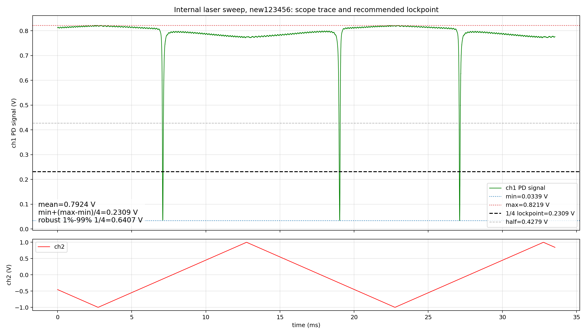

当前透过率谱读数：

| 项目 | 数值 |
| --- | ---: |
| `ch1` 最小值 | `0.03394 V` |
| `ch1` 最大值 | `0.82190 V` |
| `ch1` 平均值 | `0.79237 V` |
| 半深位置 `min + (max-min)/2` | `0.42792 V` |
| 本轮采用的 1/4 深度锁点 `min + (max-min)/4` | `0.23093 V` |

现场判断：

- 这张图作为本轮实验起点，说明当前使用的是该扫描范围内的这个光学模式。
- 本轮后续锁定点不采用半深位置，而采用整体透过率下降深度的 `1/4` 位置，即：

  `V_lock = V_min + (V_max - V_min) / 4`

- 根据本次采集结果，推荐锁定工作点为约 `0.231 V`。
- 该锁点定义与上午 `0.3 V` 设定点不同；后续比较数据时应明确区分不同实验阶段和不同锁点定义，避免混用。

### 1/4 深度锁点的推导

现场说明：

- 本轮锁点采用整体透过率深度的 `1/4` 位置，不是半高宽位置。
- 该选择来自此前对透过率谱斜率最大点的推导：传感器读出依赖腔模频移引起的透过率变化，因此希望把激光锁在透过率谱对失谐量最敏感的位置。

用归一化的凹陷型 Lorentzian 透过率谱表示：

`T(Delta) = T_min + (T_max - T_min) * Delta^2 / (Delta^2 + gamma^2)`

其中：

- `Delta` 为激光与腔模的失谐量。
- `gamma` 为与线宽相关的参数。
- `T_min` 为共振谷底透过率。
- `T_max` 为远离共振时的平台透过率。

对 `Delta` 求导：

`dT/dDelta = (T_max - T_min) * 2 gamma^2 Delta / (Delta^2 + gamma^2)^2`

最大斜率位置由 `|dT/dDelta|` 对 `Delta` 取极值得到：

`|Delta| = gamma / sqrt(3)`

将该失谐量代回透过率表达式：

`Delta^2 / (Delta^2 + gamma^2) = (gamma^2/3) / (gamma^2/3 + gamma^2) = 1/4`

因此最大斜率处的透过率为：

`T_lock = T_min + (T_max - T_min) / 4`

现场判断：

- 这说明若透过率谱可近似为单个 Lorentzian dip，则最大斜率点不是半深位置，而是从谷底往平台方向上升 `1/4` 深度的位置。
- 本轮测得 `T_min = 0.03394 V`，`T_max = 0.82190 V`，因此 `T_lock = 0.23093 V`，约 `0.231 V`。
- 该推导只给出理想 Lorentzian 模式下的推荐工作点。实际最佳锁点仍可能受模式非对称、偏振漂移、光功率、PD 线性度和反馈稳定性影响。

### 无 PID 控制下的时域 dip 观察

- 时间：2026-05-22 晚间。
- 激光源：机箱内部 DFB 激光器。
- PyRPL 配置来源：`new123456`。
- 采集状态：
  - `pid0.output_direct = off`。
  - `pid0.i = 0`。
  - `asg0.output_direct = off`。
  - `ch2/out2` 采集结果全程为 `0 V`。
  - 因此该数据对应无 PID 输出、无扫描输出下的时域状态，而不是扫频透过率谱。
- 数据文件：
  - `results/scope_traces/20260522_221921_internal_laser_no_pid_new123456_scope.csv`
  - `results/scope_traces/20260522_221921_internal_laser_no_pid_new123456_scope.json`
  - `results/scope_traces/20260522_221921_internal_laser_no_pid_new123456_scope.png`
  - `results/scope_traces/20260522_221921_internal_laser_no_pid_new123456_scope_summary.json`

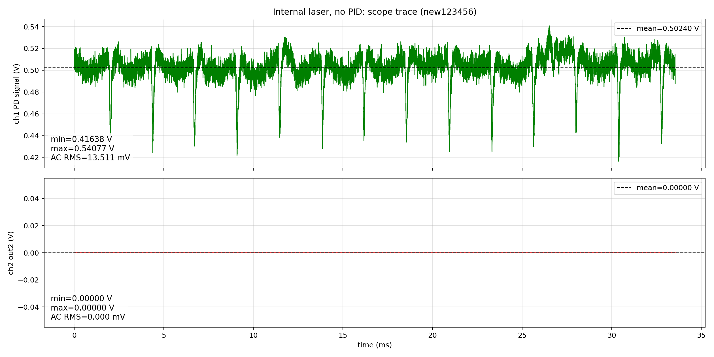

读数：

| 项目 | 数值 |
| --- | ---: |
| `ch1` mean | `0.50240 V` |
| `ch1` min | `0.41638 V` |
| `ch1` max | `0.54077 V` |
| `ch1` AC RMS | `13.51 mV` |
| `ch2/out2` | `0 V` |

现场判断：

- 在没有任何 PID 锁定输出的情况下，`ch1` 仍能看到明显 dip。
- 因为 `ch2/out2 = 0 V`，该 dip 不能简单归因于 PID 输出调制激光器波长。
- 后续需要继续区分该 dip 的来源：可能来自激光器自由漂移/热锁、环境扰动、腔体本身的热-光响应、偏振/耦合波动或其它非 PID 因素。
- 这组数据应作为后续 PID 数据解释的基线之一：若开启 PID 后仍出现同类 dip，需要先判断它是否只是无 PID 状态下已有扰动被闭环改变幅度或形态，而不是直接归因于 PID 新引入。

### P=0.01、锁点 0.231 V 下的 I sweep

- 时间：2026-05-22 晚间。
- 激光源：机箱内部 DFB 激光器。
- 锁定工作点：`0.231 V`，来自本轮模式扫描的 `min + (max-min)/4`。
- 固定参数：
  - `P = 0.01`
  - `setpoint = 0.231 V`
  - `D` 未作为变量。
- 扫描的积分参数幅值：`1, 5, 10, 50, 100, 500, 1000, 5000, 10000`。
- 采集内容：
  - 每个 I 参数下采集 10 ms scope 数据。
  - 每个 I 参数下采集 `0-100 kHz` 频谱数据。
  - 频谱图额外生成 `0-20 kHz` 低频对比。
- 配置安全：
  - 使用 `new123456` 的临时运行配置采集。
  - 原始 `new123456.yml` 未直接改写。
  - 采集结束后已将 `pid0/asg0/asg1 output_direct` 关回 `off`。
- 数据目录：
  - `results/pid_i_sweep/20260522_223741_p0p01_setpoint0p231_i_1_5_10_50_100_500_1000_5000_10000/`

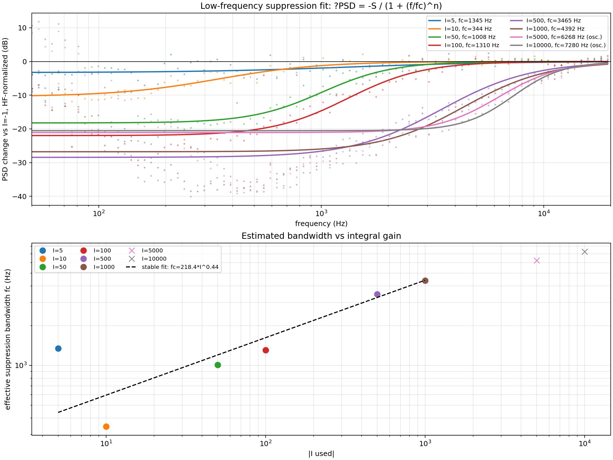

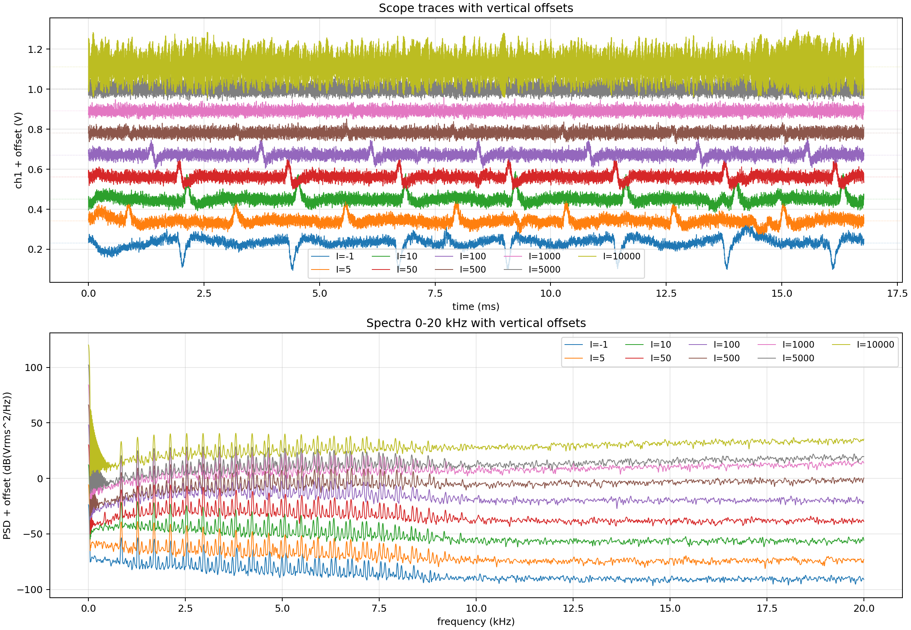

本组读数：

| I 请求值 | I 实际使用值 | 是否锁住 | `ch1` mean (V) | `ch1` AC RMS (mV) | 频谱 median (dB(Vrms^2/Hz)) |
| ---: | ---: | --- | ---: | ---: | ---: |
| 1 | -1 | 是 | 0.23206 | 30.18 | -93.89 |
| 5 | 5 | 是 | 0.23178 | 23.80 | -91.89 |
| 10 | 10 | 是 | 0.23076 | 24.50 | -91.63 |
| 50 | 50 | 是 | 0.23096 | 21.06 | -91.55 |
| 100 | 100 | 是 | 0.23093 | 18.46 | -91.52 |
| 500 | 500 | 是 | 0.23089 | 16.68 | -91.26 |
| 1000 | 1000 | 是 | 0.23090 | 16.35 | -90.88 |
| 5000 | 5000 | 是 | 0.23089 | 23.60 | -94.87 |
| 10000 | 10000 | 是 | 0.23088 | 65.38 | -99.70 |

现场判断：

- `I=+1` 初始方向未通过锁定判据，按此前经验翻为 `I=-1` 后锁住；其余参数用正 I 即可锁到 `0.231 V` 附近。
- 在一定范围内增大 I，会使时域中的 dip/peak 逐渐减弱，`ch1` AC RMS 从 `30.18 mV` 降到 `16.35 mV` 左右。
- 当前数据中，`I=500-1000` 附近时域 RMS 最低，可作为本轮较稳定的积分参数区间。
- 当 I 进一步增大到 `5000` 和 `10000`，时域波动重新增大，尤其 `I=10000` 的 AC RMS 达到 `65.38 mV`，说明积分增益过大后可能引入环路振荡或非线性动态。
- 频谱上，随 I 增大，低频噪声被逐渐压低，表现出类似低频反馈滤波/抑制的效果。
- 用 `I=-1` 作为弱反馈参考，并对 `12-20 kHz` 高频整体偏移做归一化后，采用经验模型

  `ΔPSD(f) = -S / (1 + (f/fc)^n)`

  拟合低频抑制拐点。较可靠的 `I=10-1000` 区间得到：

| I | 有效低频抑制带宽 `fc` |
| ---: | ---: |
| 10 | 约 `344 Hz` |
| 50 | 约 `1008 Hz` |
| 100 | 约 `1310 Hz` |
| 500 | 约 `3465 Hz` |
| 1000 | 约 `4392 Hz` |

- 在 `I=10-1000` 区间，经验关系约为：

  `fc ≈ 141 * I^0.50 Hz`

  该关系只表示本组数据下的有效低频抑制带宽随 I 的变化，不等同于独立标定的闭环传递函数。

对灵敏度的影响判断：

- 这组数据说明：更大的 I 在一定范围内能让模式锁得更稳定，但代价是会更强地抑制低频扰动。
- 如果低频超声信号与低频噪声都通过同一条“腔模频移 → 透过率变化 → PD 电压”的通道进入，那么闭环可能对信号和噪声产生近似同比例抑制；在这种理想情况下，信噪比或等效灵敏度未必明显变差。
- 但这仍需实验验证，不能直接作为已证实结论。原因是最终读出的通道很重要：若只读 PD 误差信号，闭环会主动压低低频信号；若同时读取 PID 控制量或做闭环传递函数校正，则可能恢复真实低频响应。
- 后续若要判断低频超声灵敏度是否受 I 参数影响，应在不同 I 下施加已知幅度的低频超声或等效波长调制，分别比较噪声 PSD、信号峰值和信噪比，而不仅比较背景噪声。

### RP 本底噪声与频谱解释边界

- 现场曾在 RP 没有接任何输入、以及接上 PD 输入时都观察到时域规则振荡和频域约 `100 kHz` 附近的鼓包。
- 用户现场判断该结构肯定属于 RP 测量链路本底噪声。
- 因此，本 session 后续解释中不把 `100 kHz` 附近鼓包归因于微腔、光路、PID 参数或超声响应。
- 后续如果比较 PID 参数对噪声的影响，应优先关注：
  - 低频 PSD 的相对变化。
  - 时域 dip/peak 是否被压低或转为振荡。
  - 避开或单独标记 RP 固有本底结构。
- 正式测量前，建议保留一组 RP input short/no optical signal 的电子本底作为参考，但本次不继续深究该本底来源。

## 周总结优先引用内容

若后续生成周总结或组会材料，优先引用以下内容：

- 本轮最终采用的光学模式与 `1/4` 深度锁点：`T_lock = T_min + (T_max - T_min)/4`，本次约为 `0.231 V`。
- 晚间有效 I sweep：`P = 0.01`、`setpoint = 0.231 V`，扫描 `I=-1, 5, 10, 50, 100, 500, 1000, 5000, 10000`。
- 有效结论：在一定范围内增大 I 会减小时域 dip/peak 和 AC RMS，同时抑制低频 PSD；`I=10-1000` 区间的有效低频抑制带宽从约 `344 Hz` 增至约 `4392 Hz`。
- 解释边界：最终读出通道为 `ch1`，因此较大 I 可能同时抑制低频噪声和低频超声信号；是否影响灵敏度需要已知低频超声或等效调制实验验证。
- PyRPL/测量流程教训：自动化采集必须使用临时 runtime config，不直接污染用户 GUI 配置。

不建议周总结主要引用的内容：

- 上午 `setpoint = 0.3 V` 的早期 I sweep。
- 上午 P-only sweep。
- 外置激光器、热锁和 PyRPL 故障排查过程。

这些内容可以作为“探索性排错/流程教训”一笔带过，但不应作为本周主要科学结论。

### 今日有效结论与边界

有效结论：

- 当前光学模式下，最大斜率工作点按 `1/4` 深度规则约为 `0.231 V`。
- 在 `P = 0.01`、`setpoint = 0.231 V` 下，改变 I 参数确实会改变低频噪声表现。
- 在一定范围内增大 I，可以减小时域 dip/peak，并降低 `ch1` 时域 AC RMS。
- 同时，增大 I 会增强对低频扰动的闭环抑制，使低频 PSD 被滤掉一部分；该抑制带宽在 `I=10-1000` 范围内从几百 Hz 增大到几 kHz。
- 当 I 过大，例如 `5000-10000`，时域波动重新变大，说明过强积分反馈可能引入环路振荡或非线性动态。

解释边界：

- 最终超声读出通道为 `ch1`，即 PD 端信号。
- 因此，如果低频超声信号也通过腔模频移引起 `ch1` 变化，较大的 I 可能同时抑制低频噪声和低频信号。
- 若信号和噪声经过同一闭环传递函数被同比例抑制，则 SNR 或等效灵敏度未必降低；但这不是今天已经证明的结论。
- 后续必须用已知低频超声激励或等效波长调制，比较不同 I 下的信号峰值、噪声 PSD 和 SNR，才能判断灵敏度是否受 I 参数影响。

不作为最终结论的内容：

- 今天早些时候的部分 I sweep、热锁、外置激光器和 PyRPL 故障排查数据主要起探索和排错作用。
- 这些记录保留用于追溯当时判断，但不作为本次“PID I 参数会滤去低频噪声”这一结论的主要证据。
- 若后续整理正式报告，应优先引用晚间 `P=0.01, setpoint=0.231 V` 的 I sweep 数据，以及对应的 1/4 锁点模式扫描图。

### PyRPL/测量流程复盘

PyRPL 相关事实：

- 今天电脑中先后存在打包版 PyRPL GUI 与 Python 虚拟环境中的 `pyrpl` 包。
- 二者共用 `C:\Users\win10\pyrpl_user_dir\config` 配置目录时，容易造成 GUI 配置状态混乱。
- PyRPL GUI 曾多次卡死，Windows 日志中记录为 `Application Hang`，挂起类型为 `Cross-thread`。
- 后台 `Pyrpl(..., gui=False)` 可连接 RP 并完成采集，说明主要问题在 GUI/Qt/pyqtgraph 界面初始化或窗口状态恢复，而不是 RP 网络连接本身。
- 后续重新下载 PyRPL 后，后台采集环境也需要兼容老 PyRPL 依赖，例如 `numpy<2`、旧 `pyqtgraph`、`PyQt5`、`quamash` 以及少量 Qt 定时器类型补丁。

流程教训：

- 自动化采集不得直接操作用户正在手动调试的 GUI 配置。
- 后台采集必须复制临时 runtime config，采完删除。
- 如果软件会自动保存配置，脚本结束前应尽量把 `pid0/asg0/asg1 output_direct` 等危险输出关回 `off`。
- 每组测量数据采完后应先判读，再决定是否写入 session；无效数据应明确标记，而不是继续堆数据。
- 采集、绘图、扫参代码应优先复用已有脚本，只通过参数、元数据和结果目录表达实验差异。
- 上述规则已沉淀到项目 skill：
  - `workspace/skills/measurement-session/SKILL.md`

## 探索性/排错记录：早期 PID 参数现场调试

本节记录上午到下午的探索性调试。它帮助发现 PID 闭环可能注入振荡、P 参数过大/过小都会导致问题，但由于锁点、配置状态和测量目标与晚间有效数据组不同，本节不作为周总结或正式结论的主要证据。

### 早期 I sweep 暴露的环路振荡问题

- 初始思路是固定 `P = 0.1`，改变 `I`，观察不同积分参数下的示波器数据和 `0-100 kHz` 频谱。
- 扫描过的 I 参数包括 `0, 1, 10, 100, 1000, 10000`。
- 每组数据采集前用 scope 检查 `ch1` 均值是否在 `0.3 V` 附近；该组测试中各 I 值的 `ch1` 均值均接近设定点。
- 后续现场观察发现：只要开启 PID，`ch1` 会出现周期性震荡；关闭 PID 后，该震荡消失。
- 进一步观察确认：`out2` 与 `ch1` 的震荡同频。

现场判断：

- 该震荡主要来自 PID 闭环反馈，而不是微腔/PD 的本底自由噪声。
- 机制判断为：`out2` 周期性调制激光器电流/波长，锁在微腔模式斜边时，波长振荡被转换为透过率/PD 电压振荡。
- 因此，直接比较 I sweep 的 PSD 并不能代表“微腔本征噪声随 I 改变”，更准确地说是在观察反馈环路注入噪声/振荡。

I sweep 结果文件：

- 汇总数据：`results/pid_i_sweep/20260522_130006_pid_i_sweep_full/summary.json`
- 示波器与 RMS 汇总图：`results/pid_i_sweep/20260522_130006_pid_i_sweep_full/figures/scope_traces_and_rms.png`
- 频谱 `0-100 kHz` 堆叠图：`results/pid_i_sweep/20260522_130006_pid_i_sweep_full/figures/spectra_stacked_0_100k.png`
- 频谱 `0-20 kHz` 堆叠图：`results/pid_i_sweep/20260522_130006_pid_i_sweep_full/figures/spectra_stacked_0_20k.png`

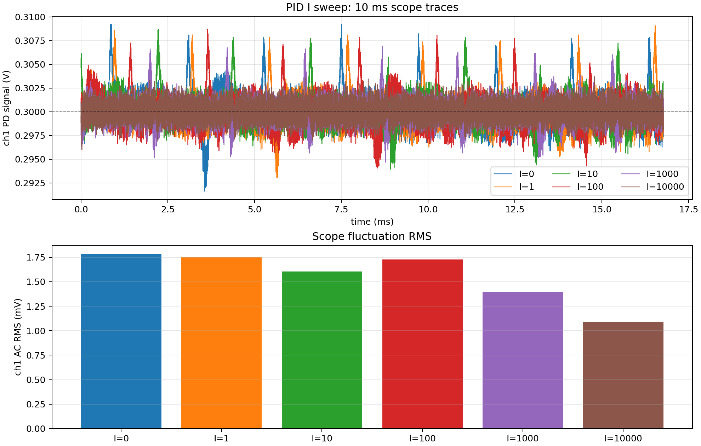

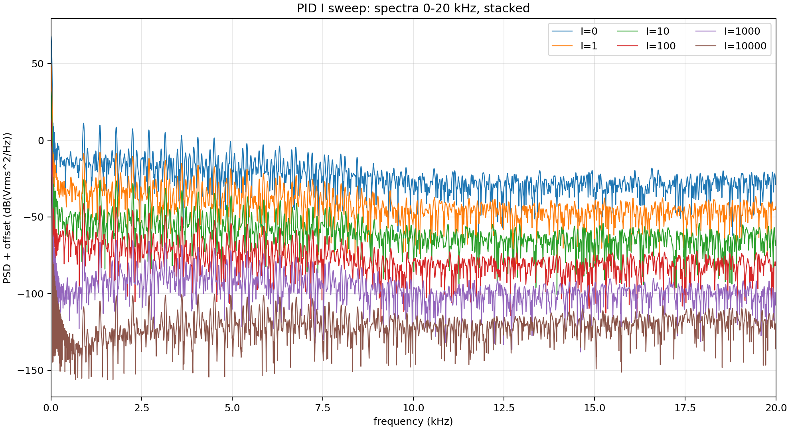

I sweep 简表：

| I | ch1 mean (V) | ch1 AC RMS (mV) | ch2/out2 AC RMS (mV) | 备注 |
| --- | ---: | ---: | ---: | --- |
| 0 | 0.300197 | 1.784 | 0.185 | 接近 setpoint |
| 1 | 0.300018 | 1.750 | 0.182 | 接近 setpoint |
| 10 | 0.300118 | 1.606 | 0.175 | 接近 setpoint |
| 100 | 0.299982 | 1.728 | 0.278 | 接近 setpoint，RMS 未继续下降 |
| 1000 | 0.299986 | 1.399 | 0.501 | 接近 setpoint |
| 10000 | 0.299985 | 1.090 | 0.683 | 接近 setpoint，但不能仅凭 RMS 判断更优 |

### 早期 P-only sweep

- 为区分比例反馈与积分反馈的作用，固定 `I = 0`，只改变 `P`。
- P 参数选择：`0, 0.01, 0.1, 1, 2, 3, 4, 5, 6, 7, 8, 9, 10`。
- 每组只采集 PyRPL scope 的两个通道：
  - `ch1 = in1`：PD 信号。
  - `ch2 = out2`：PID 输出到激光器控制端的信号。
- 由于 `I = 0`，不要求 `ch1` 均值必须锁在 `0.3 V` 附近；重点观察 peak、RMS 和高频振荡趋势。

P-only sweep 结果文件：

- 汇总数据：`results/pid_p_sweep/20260522_132239_pid_p_sweep_i0_scope/summary.json`
- 原始 scope 数据目录：`results/pid_p_sweep/20260522_132239_pid_p_sweep_i0_scope/scope/`
- 两通道叠加与 RMS 图：`results/pid_p_sweep/20260522_132239_pid_p_sweep_i0_scope/figures/scope_ch1_ch2_rms_vs_p.png`
- `ch1` mean/RMS 随 P 变化图：`results/pid_p_sweep/20260522_132239_pid_p_sweep_i0_scope/figures/ch1_mean_and_rms_vs_p.png`
- 两通道纵向偏移对比图：`results/pid_p_sweep/20260522_132239_pid_p_sweep_i0_scope/figures/scope_ch1_ch2_vertically_offset_vs_p.png`

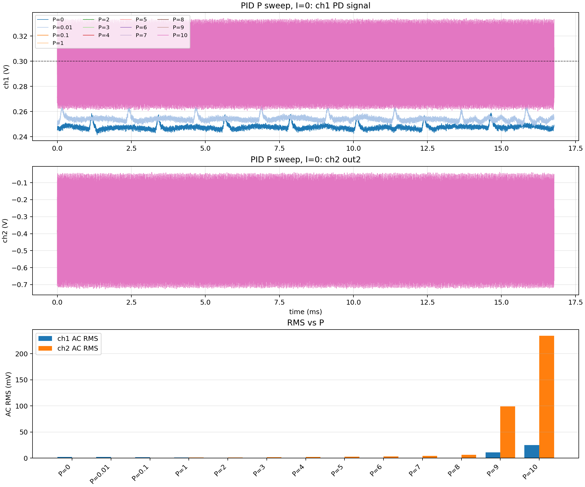

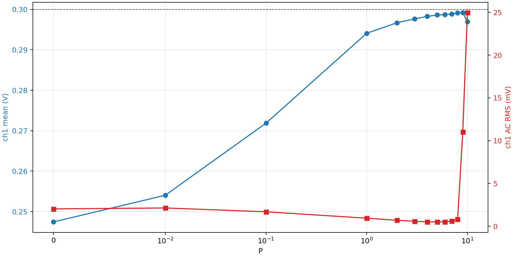

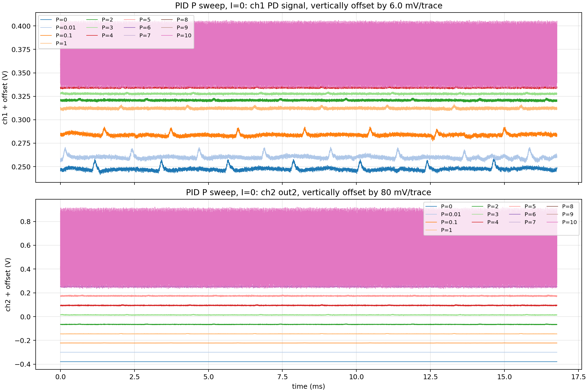

P-only sweep 简表：

| P | I | ch1 mean (V) | ch1 AC RMS (mV) | ch2/out2 mean (V) | ch2/out2 AC RMS (mV) | 现场现象 |
| ---: | ---: | ---: | ---: | ---: | ---: | --- |
| 0 | 0 | 0.247459 | 2.023 | -0.378906 | 0.000 | 未反馈，ch1 均值偏离 setpoint |
| 0.01 | 0 | 0.254058 | 2.131 | -0.379488 | 0.052 | 小 P，仍有明显 peak |
| 0.1 | 0 | 0.271872 | 1.686 | -0.381845 | 0.172 | peak 开始减小 |
| 1 | 0 | 0.294081 | 0.936 | -0.384873 | 0.936 | ch1 均值接近 setpoint |
| 2 | 0 | 0.296687 | 0.694 | -0.385570 | 1.386 | peak 继续减小 |
| 3 | 0 | 0.297638 | 0.574 | -0.386018 | 1.720 | 较稳定 |
| 4 | 0 | 0.298254 | 0.508 | -0.385901 | 2.030 | RMS 较低 |
| 5 | 0 | 0.298602 | 0.501 | -0.385898 | 2.498 | RMS 最低附近 |
| 6 | 0 | 0.298696 | 0.520 | -0.386721 | 3.111 | peak 接近最小，现场判断较优 |
| 7 | 0 | 0.298843 | 0.594 | -0.386981 | 4.152 | 开始变差 |
| 8 | 0 | 0.299100 | 0.793 | -0.386074 | 6.337 | 振荡趋势增强 |
| 9 | 0 | 0.299189 | 11.014 | -0.386159 | 99.130 | 明显进入高频振荡 |
| 10 | 0 | 0.296927 | 24.972 | -0.386867 | 234.252 | 强烈高频振荡/不稳定 |

现场判断：

- 当 `P` 很小时，`ch1` 上不是连续自激振荡，而是存在一些 peak/spike；这些 peak 随 `P` 增大逐渐被压低。
- 当 `P` 接近 `5-6` 时，peak 和 `ch1` 波动接近最小，属于当前腔和当前光电链路下的较优比例反馈区间。
- 当 `P` 继续增大到 `8` 以上，尤其 `P = 9, 10`，`ch1` 和 `out2` 出现明显高频振荡，说明比例反馈过强导致闭环不稳定。
- 因此当前系统不是 `P` 越大越好，而是存在一个折中区间：
  - `P` 太小：反馈弱，peak 抑制不足。
  - `P` 适中：peak 被压低，系统较稳。
  - `P` 太大：环路相位裕度不足，出现高频振荡。
- 现场暂定：对于当前这个低 Q 微腔，较优 `P` 区间约为 `5-6`。
- 关于 Q 值的解释目前是现场推论：低 Q 模式斜率较缓，同样波长扰动对应的 PD 电压误差信号较小，因此可能需要较大的 `P` 才能提供足够反馈强度；但该推论还依赖输入光功率、PD 增益、激光器电流调谐效率和实际锁点斜率，后续若有更高 Q 腔体应对比验证。

后续建议：

- 以 `P = 5` 或 `P = 6` 作为新的比例反馈基准。
- 在该 P 区间内重新小范围扫描积分参数，例如 `I = 0, 0.1, 0.3, 1, 3, 10, 30, 100`，重点观察是否重新引入 `out2` 与 `ch1` 同频振荡。
- 后续判断锁定质量时，不应只看 RMS；还需要同时看时域 peak、高频振荡、`out2` 同频性和频谱峰结构。

## 后续建议测量流程

1. 找到目标光学模式，并用 `1/4` 深度规则或其它明确规则确定锁定工作点。
2. 固定激光器、光衰减器、偏振控制器、光纤摆放和传感器状态。
3. 先采一组无 PID 或弱反馈基线，记录 `ch1` 时域、`ch2/out2` 状态和频谱。
4. 改变 I 参数前确认 `ch1` 均值确实锁在目标工作点附近。
5. 每组参数稳定后同时采集 scope 和 spectrum。
6. 每组数据先判读有效性，再写入 session；无效数据只作为排错记录。
7. 若要判断低频超声灵敏度，必须加入已知低频超声或等效波长调制，比较不同 I 下的信号峰、噪声 PSD 和 SNR。

## 待确认事项

- 传感器样品编号、批次或封装编号。
- 低频超声信号是否会与低频噪声被 PID 同比例抑制。
- 不同 Q 值微腔下，较优 P/I 区间是否会系统性变化。
- RP `100 kHz` 附近本底结构是否需要单独建立电子噪声基线。

## 后续结果位置

- `figures/`：现场图、频谱截图、精选图。
- `results/`：导出的 PSD 数据、汇总表。
- `scripts/`：后处理、绘图或单位转换脚本。
