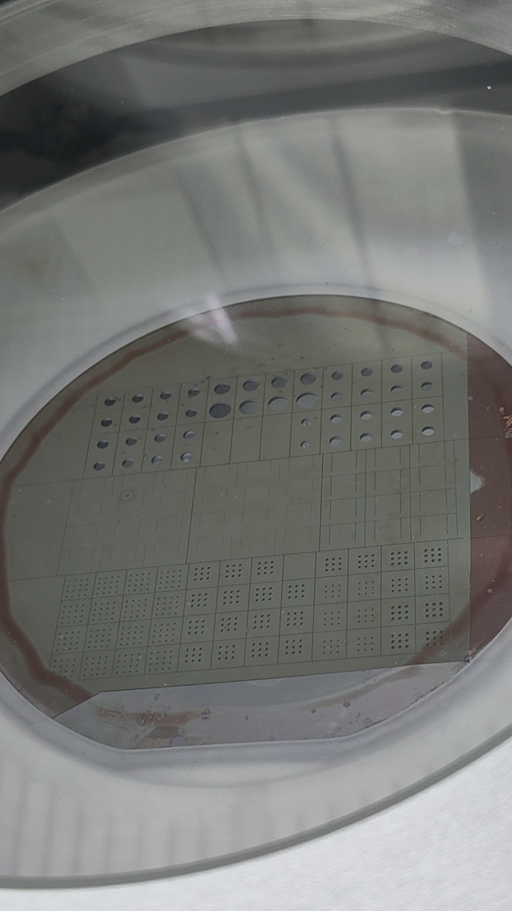
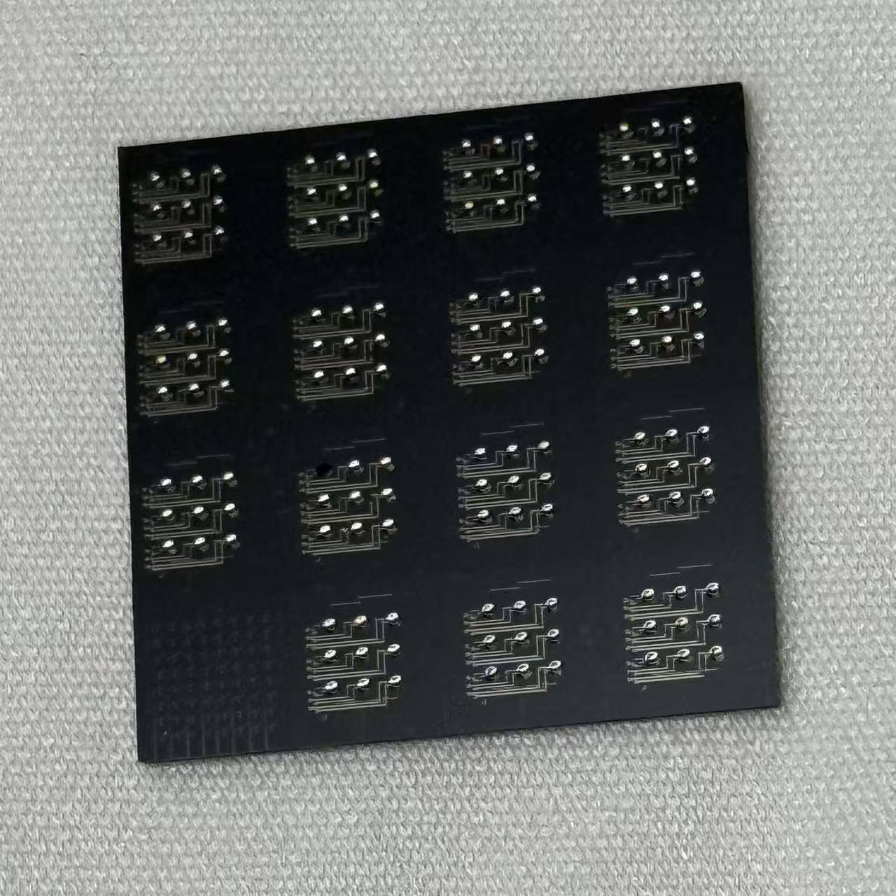
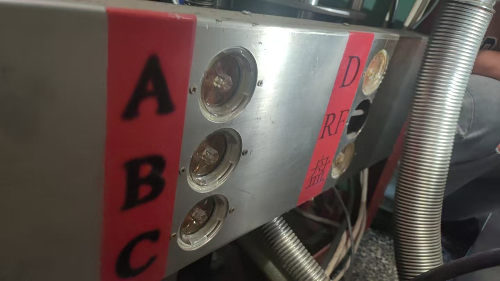
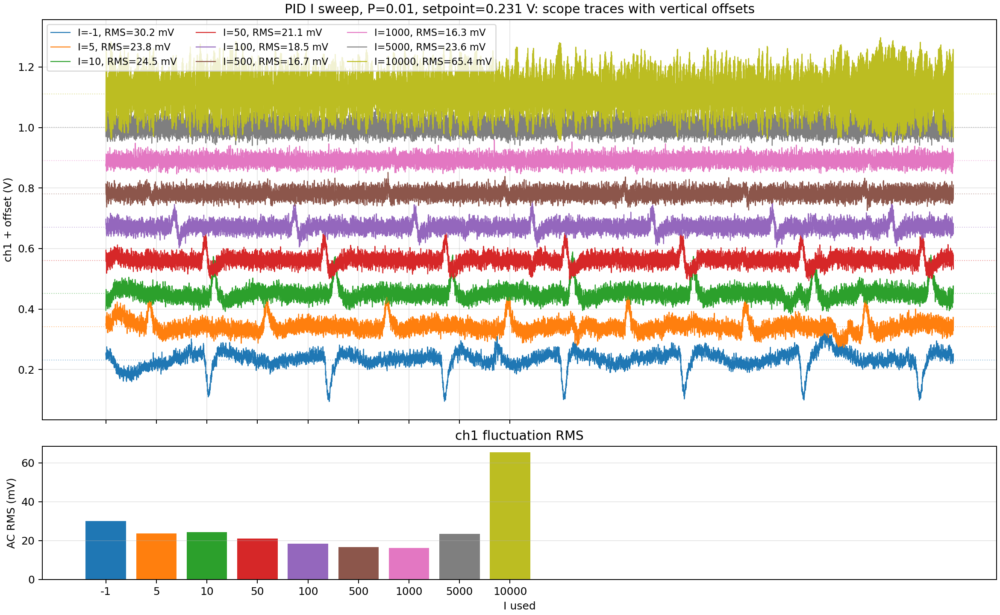
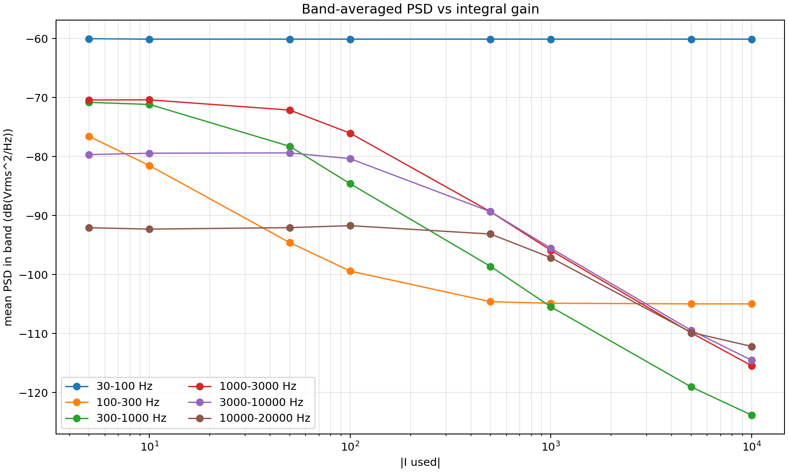

# 2026-05-18 至 2026-05-23 周总结

## 本周一句话概览

本周的主线是：一方面把深硅开洞样品推进到可测阶段，另一方面开始系统评估 Red Pitaya PID 参数对微腔传感器低频噪声 PSD 的影响。初步结果显示，PID 积分参数 `I` 可以显著抑制低频噪声，但这不等价于低频超声灵敏度提高；下一步需要用已知低频激励比较信号峰、噪声 PSD 和 SNR。

## 信息来源

- `workspace/experiments/2026-05-20/deep_si_etch_pku_changping/session.md`
- `workspace/experiments/2026-05-21/magnetron_sputtering_training_cai_lab/session.md`
- `workspace/experiments/2026-05-22/pid_noise_psd_redpitaya_microcavity/session.md`

## 本周主要进展

### 1. 深硅刻蚀：样品进入可测阶段

本周在北京大学昌平校区完成了一轮深硅刻蚀测试与正式样品加工。

关键参数与结果：

| 项目 | 结果 |
| --- | --- |
| Bosch 循环 | C4F8 5 s + SF6/O2 5 s |
| 温度 | chuck 温度 `-5 degC` |
| 正式样品气压 | `9 Pa` |
| SiO2 标定片 | `7 Pa / 50 cycle`，`2024 nm -> 1870.31 nm` |
| SiO2 消耗 | `153.69 nm`，约 `3.07 nm/cycle` |
| Si 刻蚀估算 | `9 Pa / 50 cycle`，约 `60 um`，即 `1.2 um/cycle` |
| 正式样品停止点 | `230 cycle` |

正式样品结果：

- 大洞结构完全刻透。
- 小洞单个开口约 `80%` 面积刻透，边缘仍有残留。
- 为避免继续刻蚀导致大洞薄膜破裂，本轮停止在 `230 cycle`。
- 本次 wafer 共得到 `9 个 chip`：
  - `6 个` 深硅开洞 chip。
  - `3 个` 用于片上磁力仪。
- 在 `6 个` 深硅开洞 chip 中，有 `1 个` chip 的特别小腔对应洞未刻透，后续测试时需要单独标注。

代表图片：





判断：

- 深硅开洞工艺已经把样品推进到“可测试”阶段。
- 当前更重要的不是继续刻蚀同一片，而是建立 chip/die 级测试表，记录每个 die 的腔状态、开洞完整性、裂纹和可测性。
- Si:SiO2 选择比只能做工程量级参考，因为 SiO2 数据来自 `7 Pa`，Si 数据来自 `9 Pa`，不能作为严格选择比。

### 2. 磁控溅射：沉淀 FeGaB/Ta 长厚膜设备技巧

本周在 M 楼蔡老师实验室复盘了磁控溅射仪在 FeGaB/Ta 长厚膜实验中的使用技巧。该部分不是科学数据结果，但对后续厚膜制备稳定性很重要。

典型参数：

| 材料 | 靶位 | 参数 | 速率 |
| --- | --- | --- | --- |
| FeGaB | B 路 | RF `100 W`，`0.5 Pa`，Ar 约 `35 sccm` | 约 `0.15 nm/s` |
| Ta | C 路 | `0.5 A` | 约 `100 s / 5 nm` |

厚膜结构：

- FeGaB 厚膜通常采用叠层结构。
- 典型单元：`FeGaB 200 nm + Ta 2 nm`。
- 重复堆叠到目标总厚度。

设备维护要点：

- 长膜前和长膜过程中观察当前靶位对应循环水表齿轮是否连续、顺畅转动。
- 破真空前关闭 Ar mass flow/controller 前后的手阀，避免空气进入 Ar 气路。
- 真实真空读数应在关闭 Ar 手阀后继续抽约十来分钟再看。
- 厚膜样品建议每完成 `1-2` 片清理一次靶枪、隔离罩和挡板；保险起见可每片清理一次。
- 隔离罩安装后应与靶材保持约 `1 mm` 间隙，不能接触短路。

代表图片：




判断：

- 该部分适合在组会上作为“后续 FeGaB/Ta 厚膜制备保障”一页带过。
- 它更适合进入月度总结的“工艺平台建设/设备维护规范”部分，而不是作为组会科学主线。

### 3. Red Pitaya PID 噪声测试：本周最主要的科学结果

本周完成了 Red Pitaya + PyRPL + DFB 激光器 + 微腔传感器系统的 PID 参数测试，核心问题是：

> 改变 PID 积分参数 `I` 是否会改变锁定在微腔模式斜边时的低频噪声 PSD？

平台实物：


#### 3.1 锁点选择

本轮有效数据采用 `1/4` 深度锁点，而不是半深位置。

公式：

```text
T_lock = T_min + (T_max - T_min) / 4
```

本次模式扫描读数：

| 项目 | 数值 |
| --- | ---: |
| `T_min` / `ch1` 最小值 | `0.03394 V` |
| `T_max` / `ch1` 最大值 | `0.82190 V` |
| `T_lock` | `0.23093 V` |

代表图片：


判断：

- 对理想 Lorentzian dip，最大斜率点对应从谷底向平台上升 `1/4` 深度的位置。
- 实际最佳锁点仍可能受模式非对称、偏振漂移、光功率和反馈稳定性影响。

#### 3.2 I sweep 设计

有效数据组条件：

| 参数 | 设置 |
| --- | --- |
| 激光源 | 封装机箱内部 DFB 激光器 |
| PyRPL 配置 | `new123456` 的临时运行副本 |
| 锁点 | `0.231 V` |
| P | `0.01` |
| I | `-1, 5, 10, 50, 100, 500, 1000, 5000, 10000` |
| 采集 | 每组 10 ms scope + `0-100 kHz` spectrum |

注意：

- `I=+1` 初始方向未通过锁定判据，因此用 `I=-1` 作为弱反馈参考。
- 自动化采集使用临时 runtime config，未直接污染用户 GUI 配置。

#### 3.3 I sweep 结果

关键读数：

| I 实际使用值 | `ch1` mean (V) | `ch1` AC RMS (mV) | 现场判断 |
| ---: | ---: | ---: | --- |
| -1 | 0.23206 | 30.18 | 弱反馈参考 |
| 50 | 0.23096 | 21.06 | 波动减小 |
| 500 | 0.23089 | 16.68 | 较稳定 |
| 1000 | 0.23090 | 16.35 | 较稳定 |
| 5000 | 0.23089 | 23.60 | 波动重新增大 |
| 10000 | 0.23088 | 65.38 | 明显不稳定风险 |

代表图片：





结论：

- 在一定范围内增大 `I`，可以减小时域 dip/peak 和 AC RMS。
- `I=500-1000` 是本轮较稳定区间。
- `I=5000-10000` 时波动重新增大，提示过强积分反馈可能引入环路振荡或非线性动态。

#### 3.4 低频抑制带宽

对 `I=10-1000` 区间，低频抑制带宽拟合结果为：

| I | 有效低频抑制带宽 `fc` |
| ---: | ---: |
| 10 | 约 `344 Hz` |
| 50 | 约 `1008 Hz` |
| 100 | 约 `1310 Hz` |
| 500 | 约 `3465 Hz` |
| 1000 | 约 `4392 Hz` |

经验关系：

```text
fc ≈ 141 * I^0.50 Hz
```

代表图片：


解释边界：

- 这个关系是经验拟合，不等同于独立标定的闭环传递函数。
- 它说明本轮条件下 `I` 越大，闭环对低频扰动的抑制范围越宽。

#### 3.5 对灵敏度的影响判断

核心判断：

- PID 降低低频噪声并不等于低频超声灵敏度提高。
- 最终读出通道是 `ch1`，即 PD 端信号。
- 如果低频超声信号也通过“腔模频移 -> 透过率变化 -> PD 电压”的同一通道进入，闭环可能同时压低低频信号和低频噪声。
- 若信号和噪声被同比例抑制，SNR 未必提高。

下一步必须验证：

- 施加已知低频超声或等效波长调制。
- 在不同 `I` 下比较：
  - 信号峰值。
  - 噪声 PSD。
  - SNR。

## 适合周六组会讲的内容

建议组会主线：

> 本周加工上已经得到可测开洞 chip；测量上发现 PID 积分参数会显著改变微腔读出的低频噪声 PSD。但这种“降噪”可能同时压低低频超声信号，所以下一步要用已知激励验证不同 PID 参数下的真实 SNR 和灵敏度。

建议 PPT 顺序：

1. 本周一句话总览。
2. 科学问题：PID 参数是否影响微腔低频噪声和读出灵敏度。
3. 锁点选择：`1/4` 深度锁点，约 `0.231 V`。
4. I sweep 实验设计：固定 `P=0.01`，扫描 `I`。
5. I sweep 结果：`I=500-1000` 较稳定，`I=10000` 不稳定风险。
6. 低频 PSD 抑制趋势：`fc` 随 `I` 增大。
7. 解释边界：低频噪声降低不等于灵敏度提高。
8. 深硅开洞样品进展：样品已进入可测阶段。
9. 磁控厚膜设备 checklist：作为后续 FeGaB/Ta 制备保障。
10. 下周计划。

组会建议重点讲：

- PID I sweep 的有效结果。
- `1/4` 深度锁点的选择依据。
- 低频抑制带宽随 I 增大的趋势。
- 为什么还不能直接说灵敏度提高。

组会建议弱化：

- 早期 PyRPL GUI 故障排查。
- 上午 `setpoint=0.3 V` 的探索性 I sweep。
- P-only sweep 的细节。
- 磁控溅射设备技巧的全部细节。

## 可进入月度总结的内容

- 完成深硅开洞工艺窗口探索，正式样品在 `230 cycle` 后大洞刻透、小洞约 `80%` 刻透，获得 `6 个` 深硅开洞 chip 和 `3 个` 片上磁力仪 chip。
- 建立 FeGaB/Ta 长厚膜磁控溅射设备维护 checklist，包括循环水、Ar 手阀、隔离罩间隙、靶枪/挡板清理等。
- 完成 Red Pitaya/PyRPL/PID 噪声 PSD 测量流程，建立临时 runtime config 的仪器配置隔离规则。
- 初步发现 PID 积分参数 `I` 会增强低频 PSD 抑制，`I=10-1000` 区间有效抑制带宽约从 `344 Hz` 增至 `4392 Hz`。
- 明确下一阶段关键问题：需要已知低频超声或等效调制验证 PID 低频抑制是否影响真实超声信号 SNR。

## 下周计划

1. 对深硅开洞 chip 建立 chip/die 级测试表，记录洞是否刻透、是否有裂纹、腔是否可测。
2. 用已知低频超声或等效波长调制测试不同 `I` 下的信号峰值、噪声 PSD 和 SNR。
3. 继续区分 Red Pitaya 本底噪声、闭环 PID 抑制和微腔/光路真实噪声。
4. 若继续做 FeGaB/Ta 厚膜，按本周整理的磁控溅射 checklist 执行，重点控制颗粒和冷却风险。
5. 将有效测量图和结论进一步压缩成周六组会 slides。

## 当前风险与待确认

- 深硅开洞 chip 的实际可测 die 数量还未统计。
- 小洞边缘残留和裂纹需要显微镜确认。
- 微波除胶气压参数未记录。
- Red Pitaya `100 kHz` 附近本底结构需要单独建立电子噪声基线。
- PID 对低频信号和低频噪声是否同比例抑制仍未验证。
- 传感器样品编号、批次或封装编号待确认。
